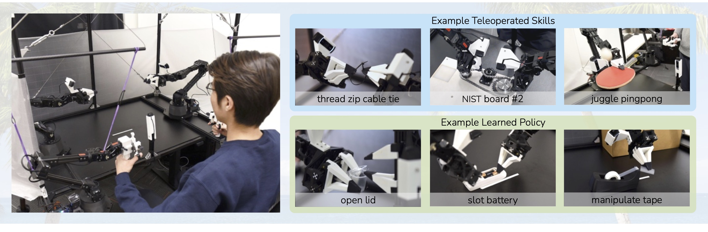
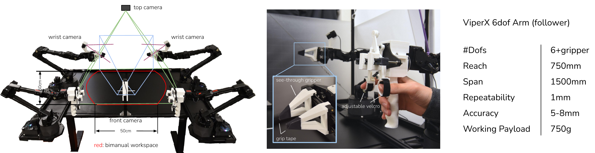
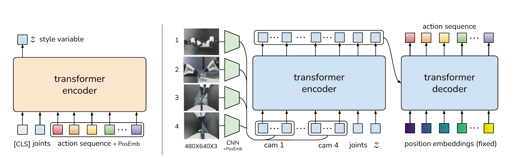
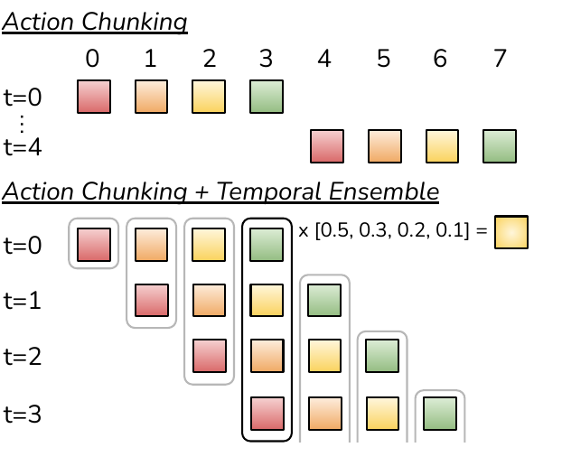
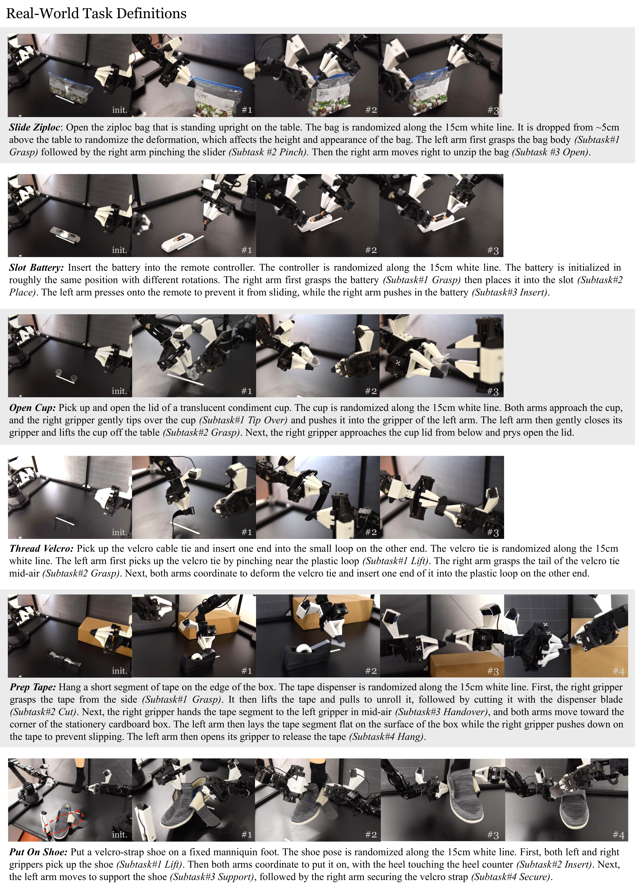
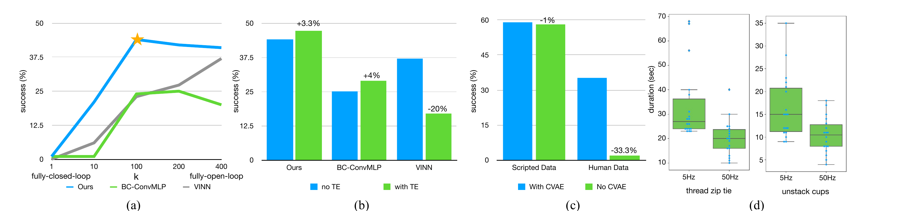

# ALOHA + ACT 慢读笔记

原文 PDF：[papers/pdfs/2304.13705.pdf](../pdfs/2304.13705.pdf) · 项目主页：<https://tonyzhaozh.github.io/aloha/> · 代码：<https://github.com/tonyzhaozh/act>

## 一句话概括

这篇论文提出了一整套"**低成本硬件 + 能在不精确硬件上学精细操作的学习算法**"的组合：硬件上是用不到 2 万美元、纯货架件 + 3D 打印搭建的双臂遥操系统 **ALOHA**；算法上是 **ACT（Action Chunking with Transformers）**——把策略建模成"在给定观测下生成一段未来动作序列"的条件 VAE，再用 **action chunking + temporal ensembling** 把模仿学习的 compounding error 压下去。两者合起来,只用约 10 分钟、50 条示范,就在 6 个真实世界精细双手机器人任务上做到 80–90% 成功率。

## 阅读路线图

论文结构（18 页，RSS 2023）：

1. Introduction — 精细操作为什么难、低成本硬件为什么更难、为什么端到端 pixel-to-action 学习是对的路线
2. Related Work — 模仿学习 / compounding error / 双手操作三条线索
3. **ALOHA 硬件（Section III）**：5 条设计原则、ViperX/WidowX 主从构型、joint-space mapping、摄像头与预算
4. **ACT 算法（Section IV）**：
   - IV-A Action Chunking + Temporal Ensemble（**方法核心**）
   - IV-B 用 CVAE 建模人类示范
   - IV-C Transformer 实现细节
5. **实验（Section V）**：6 个真实任务 + 2 个仿真任务、4 个 baseline、主结果 Table I/II
6. **消融（Section VI）**：chunk 长度 k、temporal ensemble、CVAE、高频遥操必要性（用户研究）
7. Limitations & Conclusion

关键图表地图：

| 图表 | 讲什么 | 在哪一步看 |
|---|---|---|
| Fig.1 系统总览 | ALOHA 硬件 + 遥操 + 技能示例 | 读完 intro 看 |
| Fig.3 相机/机构/规格 | 四相机视角、handle & scissor、ViperX 参数 | Section III |
| **Fig.4 ACT 架构** | CVAE encoder/decoder 数据流 | 方法核心 |
| **Fig.5 Chunking + Ensemble** | 两者如何叠加产生平滑动作 | 方法核心 |
| Fig.6/7 任务定义 | 8 个任务初始位形与子任务 | 实验前 |
| **Table I/II 主结果** | ACT vs 4 baseline | 实验 |
| Fig.8 消融四联图 | chunk k / TE / CVAE / 遥操频率 | 消融 |

---

## 1. 问题背景：精细操作 + 低成本 = 双重困难

**精细操作（fine manipulation）** 不只是"定位准"，而是需要在接触时根据环境反馈不断微调重规划——拧开调料杯盖、给电池入槽这类任务，容错是毫米级，还涉及捏、撬、撕这类精细动作，而不是搬运式的粗动作。

**为什么现有方案贵？** 主流做法靠高端机器人 + 高精度传感器 + 仔细标定，用精确的状态估计去补偿硬件的不精确。这套路线造价高、复现难。

**本文的关键转折：** 换一个思路，用**学习**去补硬件的不足。论文里举了个很有说服力的类比——人类也没有工业级的本体感觉，但靠"闭环视觉反馈 + 主动纠错"照样能完成精细操作。所以本文直接训练**端到端策略：RGB 相机图像 → 动作**（pixel-to-action）。理由：精细操作的对象往往物理性质复杂（接触、形变），建模整个环境远比学一个"看到什么就做什么"的闭环策略要难。

**为什么端到端模仿学习在这条路线上也有自身困难？**
- 策略性能高度依赖训练数据分布，而人类的示范有噪声、非平稳（同一观测可以对应多种合法轨迹）。
- 精细操作场景下 compounding error（误差随时间累积导致脱离训练分布）尤其致命，毫米级动作误差会在几步之内放大成不可恢复的状态偏离。
- 所以需要两个支点同时发力：**硬件**要能把高质量示范低成本地采进来，**算法**要能从中稳定地学到闭环行为。

---

## 2. ALOHA 硬件：<20k 美元的双臂遥操系统

左边是人推动 leader 手臂做示范、follower 同步镜像；右边是这套系统能做的精细 / 接触密集 / 动态任务。

### 2.1 五条设计原则

低门槛是本文的核心理念，具体化为 5 条原则：**低成本**（预算和一台工业臂相当）、**多功能**（覆盖真实世界多种精细任务）、**用户友好**（直观可靠易上手）、**可维修**（坏了研究者能自己修）、**易搭建**（货架件 + 3D 打印，非专业人士 2 小时内能装好）。

### 2.2 主从构型与成本

| 组件 | 型号 | 单价 | 角色 |
|---|---|---|---|
| Follower（从臂）×2 | ViperX 6-DoF | ~$5600 | 执行精细操作 |
| Leader（主臂）×2 | WidowX | ~$3300 | 人直接反驱做示范 |
| 相机 ×4 | Logitech C922x | — | 480×640 RGB，2 手腕 + 1 前 + 1 顶 |
| 其它 | 铝型材笼子、3D 打印件、抓握胶带 | — | 共 <$20k |

ViperX 规格：工作载荷 750g、臂展 1.5m、重复定位精度 1mm、绝对精度 5–8mm——**精度并不高**，这正是"低成本的代价"。

### 2.3 三个关键设计决策

**(1) 关节空间映射（joint-space mapping）而不是任务空间映射。** 不把手部姿态捕捉→逆解→任务空间动作，而是直接用一台小机器人 WidowX 的关节角映射到 ViperX 的关节角。理由两条：
- 精细操作常工作在奇异点附近，6-DoF 无冗余的货架臂离线 IK 经常失败；关节空间映射天然在关节限位内保证高频可控，还省计算、降延迟。
- leader 臂的重量天然限制了人手的速度、阻尼了小抖动——作者实测"关节空间映射在精细任务上比拿 VR 手柄体验更好"。

**(2) 3D 打印"手柄 + 剪刀"机构 + 透明手指。** 手柄降低反驱电机所需的力、支持夹爪连续开合（而非二值开闭）；"透明手指"让操作者在夹住薄塑料膜时仍能看清目标，配合抓握胶带获得可靠抓握。

**(3) 橡皮筋重力平衡。** 部分抵消 leader 侧重力，让 >30 分钟的长时间遥操不费力。

数据/控制频率：遥操与数据记录都是 **50Hz**，四路相机 30fps。相机中手腕相机随动、前/顶相机静止，前相机旋转 90° 以捕获更多纵向空间。

### 2.4 能力边界（可复现的亮点）

作者强调所有演示对象都**直接从真实世界取用、不做任何改造**，并列举三类可遥操任务：

- **精细**：穿扎带、从钱包取卡、开关保鲜袋
- **接触密集**：插 288 脚内存条、翻书页、组装 NIST 板#2 的链条和皮带
- **动态**：用真实球拍颠乒乓球、顶球不掉、凌空甩开塑料袋

并在附录 A 里对照 Shadow 遥操系统（>10 倍预算）的 15 个演示视频，用 ALOHA 复刻了其中 **14/15** 个任务（唯一不能复刻的是 Baoding ball 手内旋转，因为它需要灵巧手）。

---

## 3. ACT：Action Chunking with Transformers

ALOHA 解决"怎么采好示范"，ACT 解决"怎么从示范里学到稳定行为"。先给训练/推理流水线，再逐块讲设计。

### 3.1 核心思路：把"单步动作"换成"动作块"

模仿学习最大的毛病是 **compounding error**：单步策略 π(aₜ|sₜ) 每步都有一点小误差，误差累积起来让机器人滑出训练分布，在精细任务里几毫米就会任务失败。

ACT 的解法借用心理学的"**动作分块（action chunking）**"概念：把连续动作按单元组织起来一次执行。策略直接预测**未来 k 步的目标关节位置**：

$$\pi_\theta(a_{t:t+k} \mid s_t)$$

- k = 100（默认），即每看到一次观测就生成未来 100 步的动作，然后一口气执行。
- 效果：任务的**有效决策时域缩短了 k 倍**，每 k 步才需要一次基于观测的决策，误差被"封印"在一个块内部，不容易向外传播。
- 附带收益：能处理示范里的**时序相关混杂因素**（如示范中途的停顿）——单步马尔可夫策略只依赖状态，学不动"这里为什么停一下"；而动作块天然包含了时间上下文，且不会引入"依赖历史→因果混淆"的问题。

### 3.2 Temporal Ensemble：把重叠的块加权平均

朴素版 chunking 有个毛病：每 k 步才读一次新观测，动作切换是离散的，机器人动作会"一顿一顿"。

改进：**每个时间步都查询策略**，于是不同时刻预测的块相互重叠，同一个时间步 t 可能被多个块预测过。对 t 时刻，把预测过它的所有块的动作**指数加权平均**：

$$a_t = \frac{\sum_{i} w_i\, A_t[i]}{\sum_{i} w_i}, \quad w_i = \exp(-m \cdot i)$$

变量解释：
- `Aₜ[i]`：第 i 个旧块（越靠前越旧）里预测的、落在时刻 t 的动作
- `wᵢ`：指数权重，`m` 控制新观测被采纳的速度（m 越小，新观测进入越快）
- 分母：权重归一化

**关键细节**：这和普通平滑不同——普通平滑是把"当前动作和相邻时刻的动作"聚合（有偏），而这里聚合的是"不同块对**同一个时刻**的预测"，无偏，而且不增加训练成本，只是推理时多算一点。

上图对比：左边只做 chunking（t=0 预测 0..7 并执行，t=4 才更新）；右边 chunking + temporal ensemble（t=0,1,2,3 各自预测重叠的块，对同一时刻做加权平均），轨迹更平滑。

### 3.3 用 CVAE 建模"噪声的人类示范"

人类示范是**随机且多模态**的：同一观测下人可以走不同轨迹，且精度不重要的区域人类会更随意。如果策略只是确定性回归到平均动作，会在多模态区域输出"平均数"这种没有意义的中间动作。

所以把动作块策略训练成 **条件变分自编码器（CVAE）**：

**Encoder（训练时用，测试丢弃）**：输入 = 当前关节位置 + 目标动作序列（示范里的 aₜ:ₜ₊ₖ），压缩出一个低维隐变量 z（32 维），称作 **style variable**（风格变量，即"这一条示范想怎么干"）。参数化为对角高斯，预测均值与方差。

**Decoder（即策略本身）**：条件为当前观测 oₜ（图像 + 关节）+ z，生成 k×14 的动作序列。

训练目标 = 重建损失 + β 加权的 KL 正则，即标准的 VAE 目标：

$$\min_{\theta} \; -\sum_{s_t, a_{t:t+k} \in \mathcal{D}} \log \pi_\theta(a_{t:t+k} \mid s_t) + \beta \, D_{KL}\big(q_\phi(z \mid a_{t:t+k}, \bar{o}_t) \,\|\, \mathcal{N}(0, I)\big)$$

变量解释：
- `D`：示范数据集
- `ōₜ`：不含图像的观测（encoder 输入只用本体感觉，省算力）
- `β`（默认 10）：KL 权重，越大 z 携带的信息越少（information bottleneck 视角）
- `D_KL`：让 encoder 的分布贴近标准高斯先验

**测试时 z 取先验均值（0 向量）**，解码输出确定——这样对同一观测只产出一条动作，策略评估稳定。作者明确说 CVAE 目标对"从人类示范学精细任务"是**必不可少的**（见 6.3 消融：去掉后人类数据上成功率从 35.3% 掉到 2%）。

### 3.4 Transformer 实现与训练/推理

输入输出规格（保持精确）：

| 项 | 规格 |
|---|---|
| 观测空间 | 4×RGB 图像（480×640×3）+ 两臂关节位置（7+7=14 DoF） |
| 动作空间 | 两臂**绝对**关节目标位置，14 维向量 |
| 输出张量 | k×14（一个块的全部动作） |
| 图像编码 | ResNet18 → 15×20×512 feature map → flatten 300×512 + 2D 正弦位置编码 |
| 序列 | 4 张图拼接 1200×512 + 关节 + z（各自线性投影到 512）→ 1202×512 |
| 结构 | Transformer encoder 4 层 self-attention + Transformer decoder 7 层 cross-attention → MLP 降维到 k×14 |
| 损失 | 重建用 **L1 loss**（L2 会让动作序列建模不够精确） |
| 模型规模 | ~80M 参数，每个任务从头训练 |
| 训练 | 单张 11G RTX 2080 Ti 约 5 小时 |
| 推理 | 约 0.01 秒（比实时快得多） |

两个作者实测出的实现细节：
- **动作必须用"目标关节位置"而不是"delta 关节位置"**——用 delta 会降性能（与后来很多工作习惯相反）。
- 状态观测里**包含图像 + 当前关节位置**；动作是 leader 的关节位置（而非 follower 的），因为两者的差值隐含了施加的力（由底层 PID 隐式定义）。

数据采集：每个真实任务 50 条示范（Thread Velcro 100 条），每条 8–14 秒（50Hz 下 400–700 步），总共约 10–20 分钟示范数据（含重置和失误，墙钟时间 30–60 分钟）。仿真任务额外收了一套脚本策略生成的确定性示范用于对比。

训练（Algorithm 1）：从 D 采样 (oₜ, aₜ:ₜ₊ₖ) → encoder 采样 z → decoder 预测 → L1 重建 + β·KL → ADAM 更新。推理（Algorithm 2）：FIFO 缓冲存每个时刻被各块预测的动作，每步取加权平均执行。

---

## 4. 实验：8 个任务 × 4 个 baseline

### 4.1 任务设定

6 个真实任务 + 2 个仿真任务，全部要求精细双手操作。真实任务初始位形沿 15cm 白色参考线随机（+ 个别随机变形/旋转），仿真任务在 2D 区域均匀随机。每个任务分解为多个子任务分阶段评估（见 Fig.6/7）。

| 任务 | 子任务 | 难点 |
|---|---|---|
| **Slide Ziploc**（真实） | Grasp → Pinch → Open | 保鲜袋透明、褶皱与包装反光干扰视觉 |
| **Slot Battery**（真实） | Grasp → Place → Insert | 弹簧会让遥控器反向移动，需左手按住 |
| **Open Cup**（真实） | Tip Over → Grasp → Open Lid | 半透明杯身/杯盖，深度相机不好用 |
| **Thread Velcro**（真实） | Lift → Grasp → Insert | 黑色扎带对黑色桌面低对比、投影面积小 |
| **Prep Tape**（真实） | Grasp → Cut → Handover → Hang | 中继交接位置因人而异、需学"别撞手" |
| **Put On Shoe**（真实） | Lift → Insert → Support → Secure | 袜鞋摩擦大、两只手都要抓稳 |
| **Cube Transfer**（仿真） | Touch → Grasp → Transfer | 立方体与夹爪间隙 ~1cm |
| **Bimanual Insertion**（仿真） | Grasp → Contact → Insert | 插入间隙 ~5mm |

每个真实任务从 init 位形开始,按子任务分阶段评估,初始位形沿 15cm 白线随机。

### 4.2 Baseline 方阵

- **BC-ConvMLP**：最简单的行为克隆，CNN 提视觉特征 + 关节拼接 → 预测动作
- **BeT**：Transformer 架构，但**单步**预测（无 chunking），用离散桶 + 连续偏移输出，视觉编码器单独冻结预训练
- **RT-1**：Transformer，固定长度历史单步预测，动作离散化
- **VINN**：非参数方法，测试时检索视觉特征最近的 k 个示范观测做加权 kNN

作者在 Cube Transfer 上仔细调了 4 个 baseline 的超参（附录 D）。

### 4.3 主结果（Table I / II 转录）

**Table I**（2 仿真 + 2 真实任务；仿真列记为 [脚本数据 / 人类数据]，3 seeds × 50 次评估；真实列人类数据，1 seed × 25 次评估）：

| 任务 | 子任务 | BC-ConvMLP | BeT | RT-1 | VINN | ACT (Ours) |
|---|---|---|---|---|---|---|
| Cube Transfer (sim) | Touched | 34 / 3 | 60 / 16 | 44 / 4 | 13 / 17 | **97 / 82** |
| | Lifted | 17 / 1 | 51 / 13 | 33 / 2 | 9 / 11 | **90 / 60** |
| | Transfer | 1 / 0 | 27 / 1 | 2 / 0 | 3 / 0 | **86 / 50** |
| Bimanual Insertion (sim) | Grasp | 5 / 0 | 21 / 0 | 2 / 0 | 6 / 0 | **93 / 76** |
| | Contact | 1 / 0 | 4 / 0 | 0 / 0 | 1 / 0 | **90 / 66** |
| | Insert | 1 / 0 | 3 / 0 | 1 / 0 | 1 / 0 | **32 / 20** |
| Slide Ziploc (real) | Grasp / Pinch / Open | 0 / 0 / 0 | 8 / 0 / 0 | 4 / 0 / 0 | 28 / 0 / 0 | **92 / 96 / 88** |
| Slot Battery (real) | Grasp / Place / Insert | 0 / 0 / 0 | 4 / 0 / 0 | 4 / 0 / 0 | 20 / 0 / 0 | **100 / 100 / 96** |

（仿真行是 [脚本 / 人类] 两种数据各自的结果；真实行三个数对应三个子任务。）

**Table II**（其余 3 个真实任务，只和最强 baseline BeT 比）：

| 任务 | 子任务 | BeT | ACT (Ours) |
|---|---|---|---|
| Open Cup (real) | Tip Over / Grasp / Open Lid | 12 / 0 / 0 | **100 / 96 / 84** |
| Thread Velcro (real) | Lift / Grasp / Insert | 24 / 0 / 0 | **92 / 40 / 20** |
| Prep Tape (real) | Grasp / Cut / Handover / Hang | 8 / 0 / 0 / 0 | **96 / 92 / 72 / 64** |
| Put On Shoe (real) | Lift / Insert / Support / Secure | 12 / 0 / 0 / 0 | **100 / 92 / 92 / 92** |

### 4.4 关键结论

- **ACT 全面碾压 4 个 baseline**：仿真 4 个设置（2 任务 × 脚本/人类）下比最好 baseline 高 **59% / 49% / 29% / 20%**；真实任务 Slide Ziploc 88%、Slot Battery 96%，而其它方法在第一个子任务之后几乎全是 0——说明它们卡死在 compounding error 和示范的非马尔可夫行为上（越到 episode 末尾越崩、某些状态会无限停顿）。
- **从脚本数据换成人类数据，所有方法都掉点**：人类示范的随机性和多模态让模仿学习难得多。
- **Thread Velcro 是弱项**：每阶段成功率近乎减半（92→40→20）。两个失败模式：阶段 2 右手过早合爪没抓住半空中的扎带尾；阶段 3 插入不够精准没插进环。共同根源是黑色扎带对低对比背景 + 只占图像很小一块，视觉定位难。

---

## 5. 消融（Section VI）

### 5.1 Chunk 长度 k（图 8a）

关掉 temporal ensemble，只改 k，4 个设置（2 仿真任务 × 脚本/人类数据）平均成功率：
- k=1（无 chunking）→ **1%**
- k=100 → **44%**
- k=200、400（接近全开环）→ 略降

结论：更多的 chunking（更低的有效时域）普遍提升性能；k 太大时因为失去反应能力 + 长序列建模难而小幅回落。把 chunking 加进 BC-ConvMLP 和 VINN 也有同样的提升趋势（说明它是**通用的**技术，不依赖 ACT 本体）。

### 5.2 Temporal Ensemble（图 8b）

加了之后 ACT +3.3%、BC-ConvMLP +4%，但 VINN **−20%**。解释：TE 通过平滑模型误差收益，主要帮参数化方法；VINN 检索的是数据集里的真值动作，本身没有建模误差，平滑反而引入偏差。

### 5.3 CVAE 目标（图 8c）

- 脚本数据：去掉 CVAE 几乎无差别（数据集完全确定性）
- **人类数据：35.3% → 2%**（去掉后）

CVAE 是"从人类示范学精细任务"的命门。

### 5.4 高频遥操是否必要（图 8d，用户研究）

6 名受试者（无 ALOHA 经验，2 分钟练习后每种条件测 3 次），用两个毫米级任务（穿扎带、拆叠杯），把遥操频率从 50Hz 降到 5Hz（近期一些大网络模仿学习工作用的频率）。结果：
- 穿扎带：5Hz 平均 33s → 50Hz 平均 20s
- 拆杯：16s → 10s
- 5Hz 比 50Hz 平均**慢 62%**，重复测量统计检验 p<0.001

结论：精细操作需要高频闭环遥操，这是 ALOHA 坚持 50Hz 的原因，也解释了为什么把低频策略直接搬到精细任务会吃亏。

---

## 6. 局限（Section VII + 附录 F）

**硬件局限：**
- 需要"多根手指"的任务做不了（如儿童安全药瓶：一手压 push-tab、一手拧盖）
- 需要大力矩的任务做不了（提重物、拧紧的瓶盖、贴合的笔帽）——低成本电机力矩不足
- 需要"指甲"的任务做不了（撕贴合的包装胶带、开铝罐），透明手指已尽量做薄仍不够

**算法局限（ACT 学不来的 2 个任务）：**
- **拆糖果纸**：50 条示范，捡起 10/10、拉两端 8/10、**拆开 0/10**。原因是缝（seam）的位置在包装纸的任意处，视觉上难以分辨，人也要看印刷图案找断点；换协议每颗糖 10 试 × 5 颗后仍只有 3/5。
- **平放的小 ziploc 袋**：能稳定捡起，但随后的半空多步操作不行——袋子难感知，捡起位置的小差异会让袋子变形差异巨大，进而让"该拉的位置"差异巨大。作者认为预训练、更多数据、更好的感知是有希望的方向。

另外系统整体做不了扣衬衫纽扣这类任务。

---

## 7. 关键概念速查

- **Compounding error**：模仿学习的核心病。单步策略的微小误差随执行累积，把状态推出训练分布，越走越歪。DAgger 用 on-policy 专家纠错缓解，但作者指出遥操接口下人工标注费时且不自然；ACT 选择从"缩短有效时域"入手。
- **Action chunking**：一次预测并执行 k 步动作块，有效时域缩短 k 倍，也顺带建模示范中非马尔可夫的停顿/上下文行为。心理学来源：Lai et al. 2022 的动作分块压缩观。
- **Temporal ensembling**：每个时间步都查询策略，对"多个块预测同一时刻"的动作做指数加权平均。与普通时序平滑的区别：聚合的是对同一时刻的预测而非相邻时刻，无偏。
- **CVAE（conditional VAE）**：训练时 encoder 把"动作块 + 本体感觉"压缩成 style variable z，测试时 z=0 确定性解码。作用是多模态示范下不坍缩到平均动作。
- **Joint-space mapping vs task-space mapping**：主从臂直接关节角同步 vs 手部姿态→IK→末端动作。关节空间规避奇异点、省算力、降延迟，leader 重量还天然阻尼手抖。
- **像素→动作（pixel-to-action）**：端到端把图像直接映射到动作，对物理性质复杂对象比建模环境做规划更简单。

## 8. 我的评价 / 值得偷的想法

- **"低成本硬件 + 强学习"的互补论证是本篇最大的方法论贡献**：与其花 20 倍预算买精度，不如用算法补偿不精确。这个框架直接催生了 Mobile ALOHA（把 ALOHA 装到移动底座）等一系列工作，是本领域少见的"硬件 + 算法双支点"论文。
- **chunking 的直觉很干净**：不是靠更复杂的目标函数，而是靠"减少决策频率"来天然抑制误差传播。k=1→1%、k=100→44% 这个消融极有说服力，值得在任何一个 imitation 系统里先试这个免费杠杆。
- **temporal ensemble 的无偏平滑**是个容易抄的工程细节：普通平滑有偏，这里聚合"对同一时刻的预测"没有偏，还零训练成本。注意它对非参数方法（VINN）反而有害——别盲目套。
- **CVAE 的必要性有硬证据**（人类数据 35.3%→2%），但有个前提要留意：这是在该数据集/该任务分布下测的；脚本确定性数据下去掉没差。启示是"多模态示范 → 生成式目标"，单调示范也许不需要。
- **复现价值的注意点**：80M 参数、单卡 5 小时、推理 0.01s——训练成本在今天依然非常低，是很好的 baseline 论文；但真实任务每任务 50 条示范 + 50Hz 遥操采集是它数据贵的部分（换算法别换数据）。L1 loss、绝对关节位置（非 delta）这两个细节与很多后来的工作相反，复现时不要想当然改掉。
