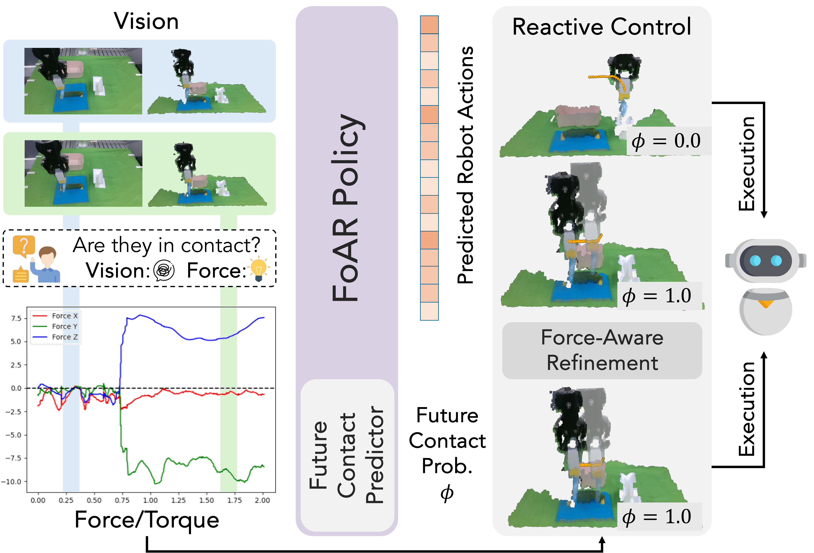
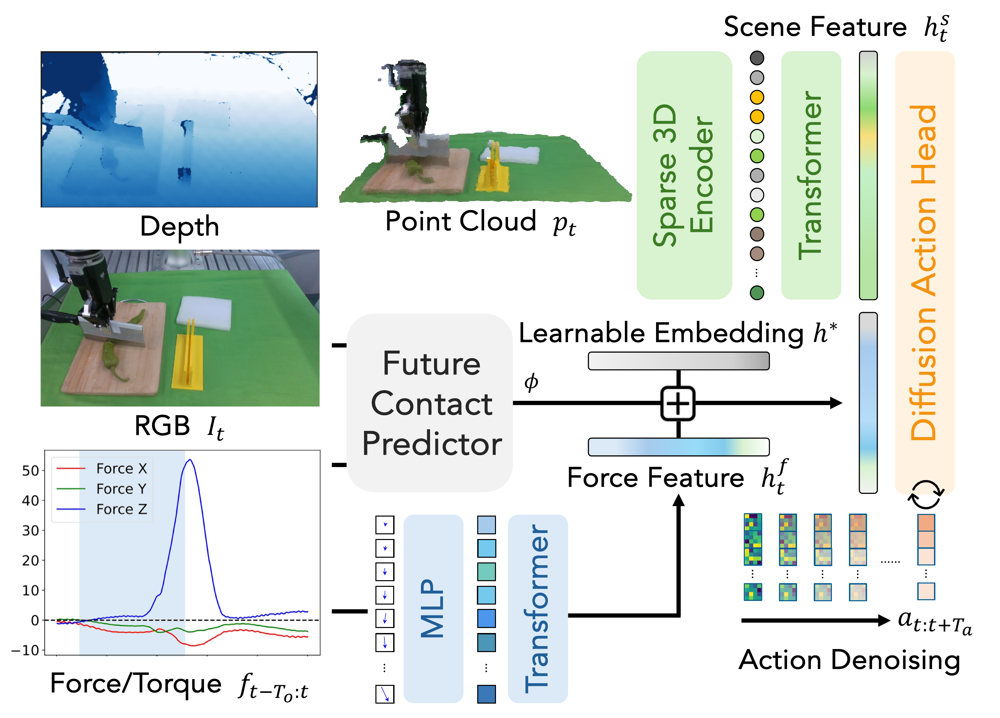
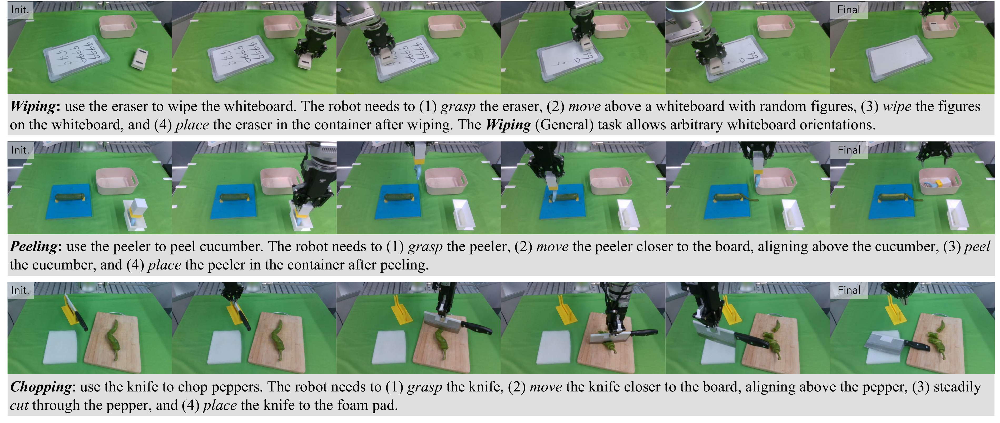
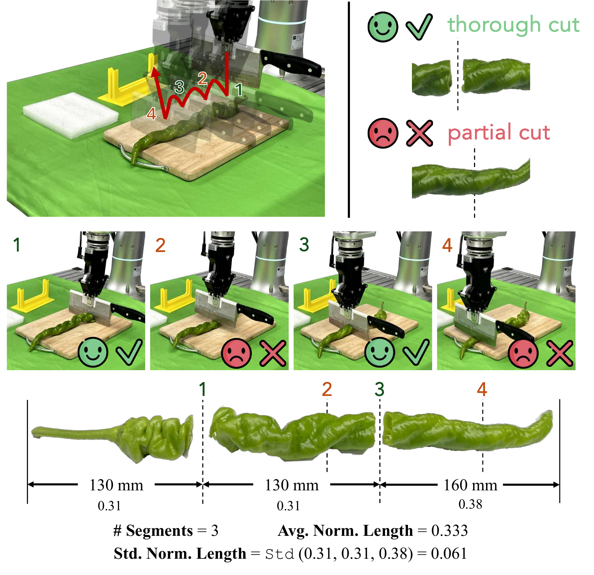
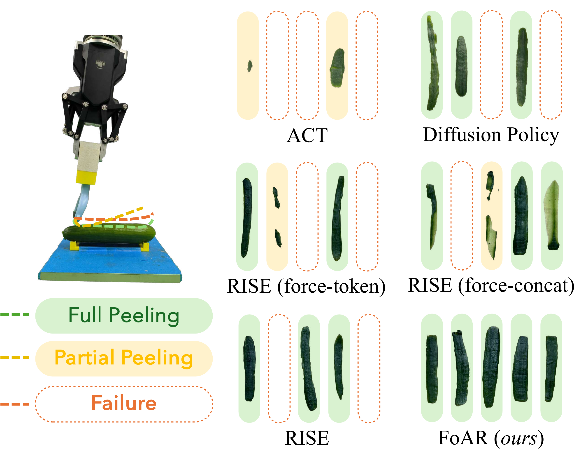

# FoAR 慢读笔记

原文 PDF：[papers/pdfs/2411.15753-FoAR.pdf](../pdfs/2411.15753-FoAR.pdf) · 项目主页：<https://tonyfang.net/FoAR/>

## 一句话概括

FoAR 在视觉策略 RISE 的基础上加了一路**高频力/力矩(F/T)输入**，核心创新是训了一个 **future contact predictor(未来接触预测器)** 输出接触概率 φ∈[0,1]，用 φ 去**动态加权融合**力特征——接触阶段放大力信号、非接触阶段用一个可学习的中性 embedding 把力信号"关掉"，从而避开非接触阶段力传感器噪声的干扰。同一个 φ 还驱动部署时的 **reactive control**：只用简单的末端位置控制，就能在力不足时朝预测方向补一小步，无需阻抗/导纳那套刚度和力方向的参数调参。3 个接触密集任务(擦白板、削黄瓜、切辣椒)上，50 条示教即大幅超过所有 baseline。

## 阅读路线图

论文结构(9 页，v2 是 2025-05 版本)：

1. Introduction — 指出纯视觉策略缺力反馈，而已有力融合方法**全程混用力数据**，忽视了"力是稀疏激活的"这一事实
2. Related Works — 力/力矩感知融入操作、接触密集操作两条线
3. **Method(方法核心)**：
   - 3.A Preliminary — 定义 RISE 基础、F/T 输入维度与频率
   - 3.B Force-Aware Policy Design — 点云编码器、F/T 编码器、**特征融合公式**、future contact predictor、action head、监督
   - 3.C Reactive Control — 部署时的 Alg.1
4. **Experiments**：3 任务 × 4 个研究问题(Q1-Q4)
   - 4.B Wiping/Peeling(表面力控)
   - 4.C Chopping(瞬时力冲击)
   - 4.D 消融(预测器 / reactive / F/T 频率)
   - 4.E 动态扰动鲁棒性
5. Conclusion

关键图表：Fig.1 系统总览(为什么需要力)、**Fig.2 架构图(方法核心)**、Alg.1 reactive control 伪代码、Fig.3 三个任务、Fig.4 削黄瓜定性对比、Fig.5 切辣椒指标定义、Table I/II 主结果、Table III 消融、Table IV 鲁棒性。

---

## 1. 问题背景：力是"稀疏激活"的，全程混用反而添乱

纯视觉策略(RISE、Diffusion Policy、ACT 等)在接触密集任务上有个根本短板：**光看图像/点云分不清"接触没接触"**。如 Fig.1 左侧所示，擦白板时接触前后的 RGB 或点云差异极小，视觉几乎读不出接触状态；而 F/T 数据一旦接触就有清晰的信号跳变，是判断接触的可靠指标。



图 1 左侧下方那张力曲线是关键直觉：Force Z(蓝线)在 t≈0.75s 处从 0 陡升到 7.5N——这个时刻视觉几乎无变化，但力信号已经明确告诉你"接触发生了"。右侧展示了 reactive control 的两种状态：φ=0.0 非接触阶段直接执行预测动作；φ=1.0 接触阶段进入 force-aware refinement，若力不足则朝预测方向补一步。

但作者强调，已有的力融合工作(如 [21,31,46])有个共同问题：**它们把 F/T 和视觉在整个操作过程里从头混到尾**，忽视了一个事实——

> 力/力矩是**稀疏激活**的。以擦白板为例，任务分多个阶段：抓起板擦 → 移到白板上方 → 擦 → 放回容器。**只有"擦"这一个阶段需要显著的接触交互**。在非接触阶段，真实力传感器本身的噪声反而会拖累策略。

很多力控工作还有个取巧的前提：**假设物体已被抓住** [1,24,46,53] 或**固定在机器人上** [21,31]，直接跳过了非接触阶段的噪声问题。FoAR 不做这个假设，要处理"抓工具 → 移动 → 接触作业 → 放回"的完整流程。

这就是 FoAR 的立意：**用一个学出来的接触概率 φ，在需要力的时候才用力，不需要的时候把力信号屏蔽掉。**

---

## 2. 方法：架构与输入输出



先把输入输出讲清楚(§3.A Preliminary)：

- **RISE 基础**：`π(pₜ) = a_{t:t+Tₐ}`，从当前点云观测直接映射到未来 Tₐ 步的机器人动作。
- **观测(两路)**：
  - 点云 `pₜ ∈ ℝ^{Nₜ×6}`(从 RGB-D 提取，含 XYZ+RGB)
  - 高频力/力矩 `f_{t-To:t} ∈ ℝ^{To×6}`(6 轴：3 力 + 3 力矩)，**约 100Hz 采样**
  - 另外 future contact predictor 还单独用一路 RGB 图像 `Iₜ`
- **两个时间尺度**(容易混，要记住)：
  - **To** = 力数据的历史窗口，高频(100Hz)。实现里 `To=200`，约等于 **2 秒**的力历史
  - **Tₐ** = 动作预测的未来 horizon，低频(约 10Hz)
- **输出**：未来动作块 `a_{t:t+Tₐ}`(末端执行器动作) + 未来接触概率 `φ`

### 2.1 两个编码器

**点云编码器**(照搬 RISE)：sparse 3D encoder(Minkowski)+ 浅层 ResNet 把点云处理成稀疏 point token `Pₜ ∈ ℝ^{Np×512}`，再过一个带 sparse point encoding 的 Transformer，得到**场景特征 hˢₜ ∈ ℝ⁵¹²**。

**力/力矩编码器**：单帧 `fₜ ∈ ℝ⁶` 先过 3 层 MLP 变成力 token `Fₜ ∈ ℝ⁵¹²`；把过去窗口的 token 序列 `F_{t-To:t} ∈ ℝ^{To×512}` 当作时间序列，用带**正弦位置编码**(沿时间轴)的 Transformer 编码，得到**力特征 hᶠₜ ∈ ℝ⁵¹²**。

### 2.2 特征融合：φ 加权(FoAR 的灵魂)

这是全文最核心的一个公式。作者不用简单拼接或直接把力 token 塞进 Transformer(说这会让噪声力在非接触阶段捣乱)，而是用 φ 来做门控式融合：

$$
h_t = \Big[\, h^s_t \;;\; \phi(t)\cdot h^f_t + \big(1-\phi(t)\big)\cdot h^* \,\Big]
$$

- **hˢₜ**：场景特征(视觉，永远保留)
- **hᶠₜ**：力特征
- **φ(t) ∈ [0,1]**：future contact predictor 输出的未来接触概率
- **h\***：一个**可学习的中性 embedding**(learnable embedding)
- **[· ; ·]**：拼接

**直觉**：融合特征永远保留视觉 hˢₜ；力那一路是 hᶠₜ 和中性 h\* 的**凸组合**。φ→1(要接触)时力特征 hᶠₜ 被放大；φ→0(非接触)时力被 h\* 顶替、几乎"关掉"。换句话说 **φ 是一个软开关，决定这一刻要不要听力传感器的话**。这样既在接触阶段充分用力，又不让非接触阶段的力噪声污染决策。

### 2.3 Future Contact Predictor：预测"未来会不会接触"

注意它预测的是**未来**步会不会接触，不是当前是否接触——这点是它比"接触检测"强的关键(见消融)。

输入用的是 **当前 RGB 图像 Iₜ + 力历史 f_{t-To:t}**，作者给了两条理由：

1. 用 RGB(而非点云)能让预测器更轻量，且在"判断接触状态"这件事上 RGB 和点云表现相当；
2. 力数据虽然不能直接预测未来接触，但能在**意外接触发生时纠正预测器**。

实现：ResNet18 视觉编码器 + MLP 力编码器 → 特征拼接 → 一个 linear 层输出概率 φ。

### 2.4 Action Head 与监督

**Action Head**：融合特征 hₜ 作为 diffusion action head 的 conditioning，通过去噪逐步细化噪声动作轨迹(Diffusion Policy 那套)，生成末端执行器动作。

**监督(两项 loss)**：

$$
\mathcal{L} = \mathcal{L}_\text{action} + \alpha\,\mathcal{L}_\text{predictor}
$$

- **Lₐcₜᵢₒₙ**：动作用示教里的 ground-truth 动作做 L2 监督(在 diffusion 过程里)
- **Lₚᵣₑdᵢcₜₒᵣ**：接触预测用**二元交叉熵**监督
- **α**：权重，实现里 `α=0.1`

关键细节——**ground-truth 未来接触标签怎么来的**：直接从示教数据里**自动抽取**——看当前时刻周围一个时间窗口内，力/力矩是否超过阈值 δ_demo,超过就标为"接触"。**不需要人工标注接触**，这让训练很省事。

---

## 3. Reactive Control：同一个 φ 驱动的部署策略

作者的一个重要主张：**不用阻抗控制/导纳控制/混合力位控制那一套**(它们都要额外调刚度、力方向等参数)，只靠 φ + 简单末端位置控制就能做力反馈驱动的接触作业。

Alg.1(FoAR Inference with Reactive Control)的逻辑：

```
每个 inference step:
  1. 采集 pₜ, Iₜ, f_{t-To:t}, qₜ(当前末端位姿)
  2. φ, a_{t:t+Tₐ} ← FoAR(pₜ, f_{t-To:t}, Iₜ)      # 一次前向同时出概率和动作
  3. if φ < δ_φ:                                    # 非接触阶段
        buffer.add(动作)                            # 存进"非接触" ensemble buffer
     else:                                          # 接触阶段
        if force(fₜ) < δ_f and torque(fₜ) < δ_t:    # 力/力矩不足
            d ← avg(a_{t:t+T_f}).pos − qₜ.pos        # 估计未来动作方向
            a.pos ← a.pos + ε·d/‖d‖₂                 # 朝该方向补一小步 ε
        contact_buffer.add(动作)                     # 存进"接触" ensemble buffer
  4. 执行时: φ<δ_φ 取 buffer,否则取 contact_buffer
```

三个要点：

1. **φ 做相位判断**：`φ > δ_φ` 就认为"正在或即将接触"，此时才检查实测力。
2. **力不足才纠偏**：如果处于接触相但实测力/力矩低于阈值(δ_f=8N, δ_t=5N·m)，说明还没真正压实，就用预测动作块估一个未来方向 `d`，把动作朝这个方向平移一小步 `ε=0.006m`。这就是 Fig.1 里的 "Force-Aware Refinement"。
3. **两个独立的 temporal ensemble buffer**：接触相和非接触相各用一个 ACT 式的 temporal ensemble buffer,避免两相动作互相干扰，同时保证轨迹平滑。

参数(Wiping)：`δ_φ=0.9, δ_f=8N, δ_t=5N·m, ε=0.006m`。

**这套的巧妙之处**：接触预测器是策略的一部分(训练时学出来的),它的输出 φ **同时**服务于(a)特征融合门控 和 (b)部署时的 reactive control——策略与控制器是**co-design**(协同设计)的，消融显示这个耦合很关键。

---

## 4. 实验

**平台**：Flexiv Rizon 机械臂 + 大寰 AG-95 夹爪，法兰与夹爪间装 **OptoForce 力/力矩传感器**;前方一台 RealSense D435 RGB-D 相机;工作空间 45×60×40cm。数据靠 haptic teleoperation 采集。

**三个任务(Fig.3)** 分两类：



- **表面力控(surface force control)**：
  - **Wiping**(擦白板)：抓板擦→移到白板上方→擦掉图案→放回容器。考察**持续稳定接触**。另有 Wiping(General) 变体允许白板任意朝向。
  - **Peeling**(削黄瓜)：抓削皮器→对准黄瓜→削皮→放回。考察**精度与敏感度**。
- **瞬时力冲击(instantaneous force impact)**：
  - **Chopping**(切辣椒)：抓刀→对准→稳定切断→放到泡沫垫。考察**瞬时力/力矩控制**。

每个任务只用 **40~50 条示教**。评测指标是 **ASR(action success rate,动作成功率)** + 任务专属 score(擦干净比例、削皮比例、切段数量与均匀度)。

**Baseline**：视觉策略 ACT / Diffusion Policy / RISE,再加三个消融变体：
- **RISE(force-token)**：把力 token 作为额外 token 塞进 RISE 的 Transformer
- **RISE(force-concat)**：直接把力特征和视觉特征拼接
- **FoAR(3D-cls)**：future contact predictor 直接**共享**策略的 sparse 3D 编码器,而不是用单独的图像编码器

### 4.1 主结果(Table I：Wiping / Peeling)

| Method | Wiping Score↑ | Wiping ASR(Grasp/Wipe) | W.(General) Score↑ | Peeling Score↑ | Peeling ASR(Grasp/Peel) |
|---|---|---|---|---|---|
| ACT | 0.275 | 65 / 50 | 0.250 | 0.120 | 95 / 25 |
| Diffusion Policy | 0.400 | 75 / 60 | 0.350 | 0.386 | 85 / 70 |
| RISE | 0.500 | 100 / 75 | 0.500 | 0.377 | 100 / 50 |
| RISE (force-token) | 0.575 | 85 / 80 | 0.600 | 0.487 | 95 / 75 |
| RISE (force-concat) | 0.475 | 100 / 65 | 0.675 | 0.524 | 100 / 80 |
| FoAR (3D-cls) | 0.175 | 40 / 35 | 0.200 | 0.270 | 95 / 40 |
| **FoAR (ours)** | **0.875** | **100 / 100** | **0.850** | **0.756** | **100 / 100** |

读表要点：

- **FoAR 全面碾压**：三项 score 0.875 / 0.850 / 0.756,接触作业 ASR 全部 100%。
- **简单融合确实有点用但不多**：RISE(force-token/concat) 比纯 RISE 略好,说明"加力"本身有价值,**但怎么融合才是关键**——简单拼接/塞 token 反而在非接触阶段引入噪声,甚至拉低抓取成功率(force-token 的 Grasp 只有 85%)。
- **FoAR(3D-cls) 灾难性下滑(0.175，甚至远低于 RISE)**：这验证了 §4.D 里 Q2 的结论——**预测器必须和策略骨干用各自独立的视觉编码器**。因为两者需要的视觉特征差异很大:预测器只关心"板擦是否在白板上方"(粗粒度),而策略要精确的物体和末端位置(细粒度),共享一个编码器会造成 attention 冲突、互相干扰。

### 4.2 Chopping(Table II)



| Method | #Segments↑ | Avg.Norm.Length↓ | Std↓ | ASR(Grasp/Place) |
|---|---|---|---|---|
| RISE | 1.8 ± 0.6 | 0.727 | 0.411 | 100 / 30 |
| **FoAR** | **3.9 ± 0.9** | **0.353** | **0.094** | **100 / 70** |
| Oracle(示教) | 5.0 ± 0.0 | 0.200 | 0.056 | 100 / 100 |

切段数量翻倍(3.9 vs 1.8)、平均段长更短、方差更小(0.094 vs 0.411),说明 FoAR 切得**更多、更均匀**。纯视觉的 RISE 靠图像判断不出刀切进多深,切不透。

### 4.3 消融(Table III：Wiping)

| F/T Freq. | w. Predictor | w. Reactive | Score↑ | ASR(Grasp/Wipe) |
|---|---|---|---|---|
| 100Hz | ✗ | ✓ | 0.650 | 100 / 85 |
| 100Hz | ✓ | ✗ | 0.650 | 100 / 80 |
| 2Hz | ✓ | ✓ | 0.625 | 100 / 85 |
| 10Hz | ✓ | ✓ | 0.800 | 100 / 100 |
| **100Hz** | ✓ | ✓ | **0.875** | **100 / 100** |

三个设计缺一不可(Q3)：

- **去掉 predictor(用接触检测替代)**：会"偶尔碰不到",接触检测导致延迟甚至漏接触——**预测未来 > 检测当前**。
- **去掉 reactive control**:score 掉到 0.650。且 reactive control 依赖策略里 predictor 输出的 φ,再次印证 policy 与 controller 的 **co-design**。
- **F/T 频率**：2Hz(0.625) → 10Hz(0.800) → 100Hz(0.875),高频更好,但 100Hz 是计算效率与性能的折中。

### 4.4 动态扰动鲁棒性(Table IV，Q4)

对 Wiping(General) 做三种扰动:(1) **Rewrite**:擦完在原处又写新图案;(2) **Move**:擦完把白板挪位置;(3) **Rewrite+Move**:两者叠加。

| Method | Original | Rewrite | Move | Rewrite+Move |
|---|---|---|---|---|
| RISE | 0.500 | 0.500 | 0.600 | 0.500 |
| RISE(force-token) | 0.600 | 0.450 | 0.500 | 0.600 |
| **FoAR** | **0.850** | **0.800** | **0.850** | **0.800** |

FoAR 在所有扰动下保持稳定(0.80~0.85)。RISE(force-token) 在这些复杂场景反而更差——作者推测:扰动把策略逼回"非接触相",需要重新生成动作,而此时的力噪声进一步放大误差。FoAR 因为有 φ 门控,天然屏蔽了这种噪声。

---

## 5. 削黄瓜的定性对比



图 4 用颜色区分削皮质量:绿=完全削(full peeling)、黄=部分削(partial)、红=失败。FoAR(右下)明显更多绿色,ACT/DP/RISE 及各变体常常只能部分削或直接失败。直观说明了缺力反馈时,末端压不稳黄瓜表面,削皮器要么太浅(削不下)要么打滑。

---

## 6. 与你已有笔记的关系 & 定位

- **和 [[2506.16685-CR-DAgger]] 对比**：两篇都做接触密集操作、都强调"力",但切入点不同。CR-DAgger 走的是**人在环 DAgger + 残差策略 + 顺应控制**,靠人的 delta 修正来补;FoAR 走的是**纯离线模仿 + 学一个接触概率来门控力融合**,部署时用轻量 reactive control。可以并读:FoAR 解决"力什么时候该用",CR-DAgger 解决"策略错了怎么用人修"。
- **和 [[2304.13705-ALOHA-ACT]] 的关系**：FoAR 的 temporal ensemble buffer 直接借用 ACT;但 FoAR 用了两个独立 buffer(接触/非接触相)避免互相干扰,是对 ACT 的一个针对接触任务的改造。
- **在"末端接触/期望力"这条线里的位置**：FoAR 属于"**预测未来接触时刻 + 门控力融合**"这一支,不直接回归期望力数值(不像 admittance/impedance 那种输出 desired force / stiffness);它主张用简单位置控制 + 力反馈补偿绕开显式力控参数。如果你要的是**直接预测期望 wrench**,FAWAM(arXiv 2606.08555)那种"同时预测动作和末端 wrench"更贴;FoAR 更像"**判断何时该听力,然后微调位置**"。

## 7. 复现价值与边界

**优点/可复现点**：

- 思路清晰、改动小:核心就是"RISE + 力编码器 + φ 门控融合 + 两项 loss + reactive control",在已有点云策略上加一路力不难。
- **接触标签自动抽取**(力超阈值即接触),省掉人工标注。
- 硬件常见(Flexiv + OptoForce + RealSense),50 条示教量级低。

**边界/未说清的地方**：

- 只在**单臂 + 手持工具**的 3 个任务上验证;作者自己把双臂/人形/灵巧手列为 future work。
- reactive control 的补偿是**朝预测方向平移固定小步 ε**,本质是启发式,不是真正的力闭环;对"需要精确期望力大小"的任务(如按压到某个特定力值)未必够。
- 各阈值(δ_φ, δ_f, δ_t, ε, δ_demo)是按任务手调的,论文只给了 Wiping 的值,跨任务迁移的敏感度没有系统分析。
- 力/位置控制频率、diffusion 去噪步数等训练细节大部分"沿用 RISE",note 里能确认的仅 To=200、α=0.1、100Hz F/T、10Hz 动作。

## 8. 一句话记忆点

**FoAR = RISE + 学一个"未来接触概率 φ" + 用 φ 软开关式门控力特征融合 + 用同一个 φ 驱动简单位置控制的力补偿。** 关键洞察:力是稀疏激活的,别全程混用;何时用力,让模型自己学着预测。


