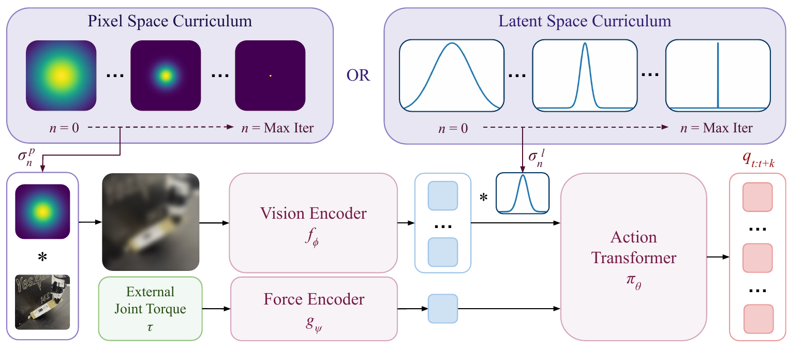
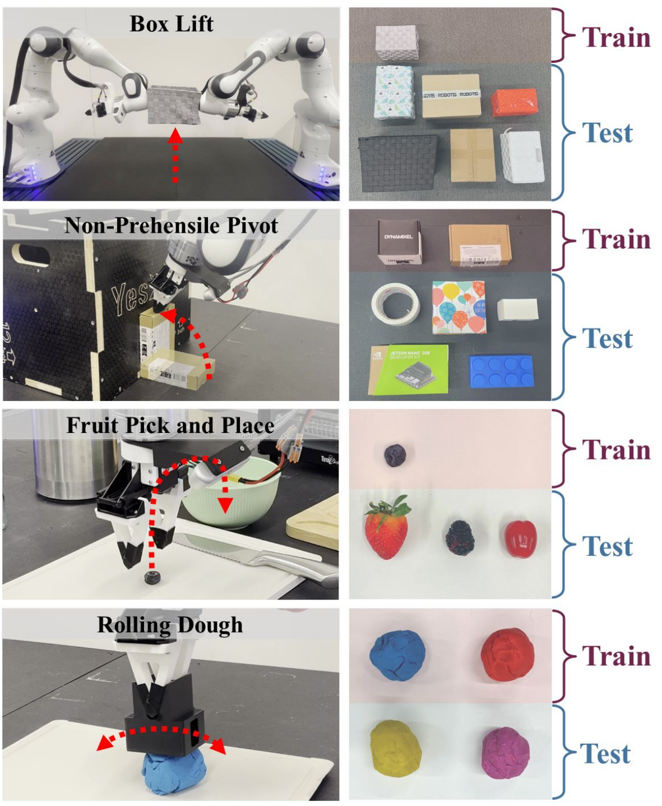
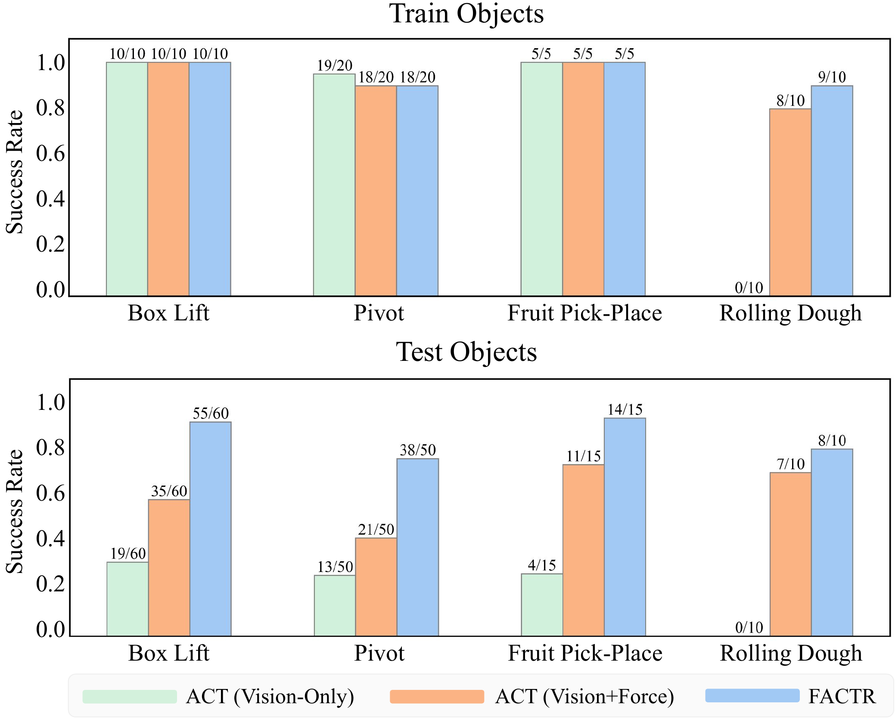
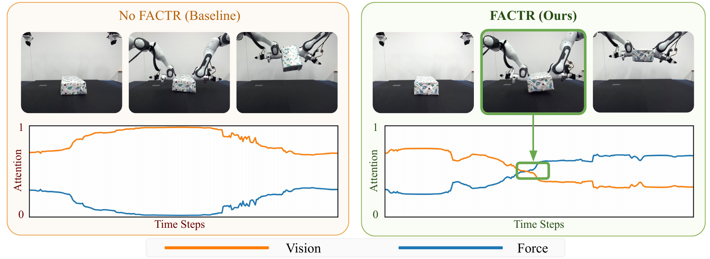

# FACTR 慢读笔记

原文 PDF：[papers/pdfs/2502.17432-FACTR.pdf](../pdfs/2502.17432-FACTR.pdf) · 项目主页：<https://jasonjzliu.com/factr/> · CMU (Deepak Pathak 组)

## 一句话概括

前面读的 [[2509.07962-TA-VLA|TA-VLA]] / [[2505.22159-ForceVLA|ForceVLA]] / [[2602.23648-FAVLA|FAVLA]] 都在改**架构**(力放哪、怎么融、什么频率),FACTR 换了个完全正交的思路:**架构不动,改训练过程**。它指出一个朴素但要命的问题——**力信号大部分时间接近 0(没接触时),判别性弱,策略会偷懒、过拟合到视觉、干脆无视力**。解法是一个**课程(curriculum)**:训练早期把视觉输入**狠狠模糊/降采样**(所有画面糊成一团、无法区分),逼策略只能靠**力**来区分不同状态、把梯度都用来更新力编码器;随训练推进逐渐**解模糊**、放回视觉细节。这样训出来的策略真正学会"该看力的时候看力"。用一个标准 ACT(视觉 token + 单个力 token 进 encoder-decoder transformer)当骨干,力来源是机械臂**自带的外部关节力矩(external joint torque)**——无需外置力传感器。结果:在 4 个接触密集任务上对**未见过物体**的泛化成功率从"朴素加力"的 61.2% 提到 **87.5%**(+40%),纯视觉只有 21.3%。另外还附带一套低成本双边力反馈遥操系统。并用 **Neural Tangent Kernel** 给了课程为何有效的理论说明。

> **为什么值得读**:它给"力进模型"补了一条 architecture 之外的路线——**训练式/课程式**。前面几篇解决"力放哪能被用上",FACTR 解决"**放进去了也可能被无视,怎么逼模型真去用它**"。两类手段可叠加。

## 阅读路线图

1. **Intro** — 两个 under-utilization:遥操没力反馈;策略过拟合视觉、无视力
2. **Teleop 系统**(贡献一,力控相关但非"力进模型")— 把 follower 外部关节力矩回传 leader + 重力/冗余/摩擦补偿
3. **FACTR 方法**(贡献二,核心):
   - Base 策略:ViT 视觉 token + MLP 力 token → encoder-decoder transformer(ACT 式)→ 关节位置动作
   - **力-注意力课程**:模糊算子 β_P(像素)/ β_L(latent),scale σ_n 随训练递减
   - 算子(高斯模糊 / 降采样)、调度器(linear/cosine/exp/step)
   - **NTK 理论**:为何大 σ 会逼模型用力
4. **实验** — 遥操 user study、策略泛化主结果、注意力可视化、恢复行为、课程消融

关键图:**Fig.1 method(课程机制,核心)**、Fig.2 tasks、Fig.3 results、Fig.4 attention(力 vs 视觉注意力)、Fig.5 teleop、Fig.6 torque pattern。

---

## 1. 问题:把力"塞进去"不等于模型"会用"

FACTR 抓的痛点和前几篇不同。前几篇默认"只要融合方式对,力就能用上";FACTR 指出即便你把力当输入拼进去,**策略仍会无视它**,原因是:

- **力信号判别性弱**:一条轨迹里大部分时间机械臂没接触,力≈0,只有接触瞬间才有信号。相比之下视觉每帧都花花绿绿、信息密。
- **BC 会走捷径**:行为克隆下,策略发现"光看视觉就能拟合训练集",于是过拟合视觉、把力编码器晾在一边 → 一遇到**没见过的物体**(视觉变了但接触物理没变)就崩。

这正是纯视觉策略泛化差的根源:对像 box lifting 这种任务,决定动作的是**几何/接触**(什么时候夹到了),而不是颜色纹理。力本该提供"接触了没"这个**模式切换(mode switch)**信号,但被无视了。

---

## 2. 方法:力-注意力课程(FACTR)

### 2.1 骨干策略(标准 ACT,架构不新)

- 输入:RGB 图 `I_t` + 外部关节力矩 `τ_t`。
- ViT 视觉编码器 → 视觉 token `z^V ∈ ℝ^{M_v×d}`;MLP 力编码器 → **单个力 token** `z^F ∈ ℝ^{1×d}`。
- 拼接 `X = [z^V; z^F]` → transformer **encoder**(self-attention)→ `k` 个 action token 在 **decoder** 里 cross-attention 到编码后的视觉+力 → MLP 输出未来 `k` 步关节位置 `q_{t:t+k}`。
- 损失就是最普通的 BC:`MSE(q̂, q)`。**注意:这个架构本身没有任何"力融合"新意——新意全在训练。**

### 2.2 课程:用"糊视觉"逼模型用力

核心操作:对视觉施加一个**模糊/降采样算子**,强度 `σ_n` 随训练步 n **从大到小**:

- **像素空间** `β_P(I, σ)`:高斯模糊 `I * G_σ` 或 MaxPool 降采样。
- **latent 空间** `β_L(z^V, σ)`:对视觉 token 做 1D 高斯模糊。
- 调度器把 σ 从 σ₀ 递减:constant / **linear** / cosine / exp / step(默认 latent + 高斯模糊 + linear)。

**直觉**:训练早期 σ 很大 → 所有图像糊成几乎相同的一团 → 视觉**无法区分**不同样本 → 策略要想降 loss,只能去更新**力编码器**、用力来区分状态。随着 σ 减小,视觉细节逐步放回,策略在已经"学会用力"的基础上再融入视觉。**先学力,再补视觉**,避免一上来就过拟合视觉。

### 2.3 NTK 理论解释(为什么有效)

用 Neural Tangent Kernel 在一个两层模型上说明:模型对输入先卷高斯核 `f(x)=Wᵀ(K_σ * x)`,则 NTK 是卷积后输入的内积。当 σ→∞,所有 `K_σ*x_i` 收敛到同一向量 φ,**NTK 矩阵退化成 rank-1 全 1 矩阵**——梯度流下只能学到"对所有视觉输入输出同一个全局值"(损失只能靠匹配标签均值下降),视觉这条路**丧失判别力**。于是早期梯度被迫去更新**力编码器**来区分样本。σ 减小后视觉判别力恢复。理论和"先学力"的直觉对上了。

---

## 3. 实验

**硬件/任务**:Franka Panda 臂 + OpenManipulator-X 夹爪;力=机械臂**外部关节力矩**(Franka/KUKA 自带,无外置 F/T 传感器)。4 个接触密集任务:**Box Lift**(双臂抬箱)、**Non-Prehensile Pivot**(把物体顶着墙角翻 90°)、**Fruit Pick-and-Place**(抓软水果)、**Rolling Dough**(擀面团)。每任务 50 条示教。
**baseline**:ACT(纯视觉)、ACT(视觉+力,无课程)、FACTR(视觉+力+课程)。

### 主结果:对未见物体的泛化

**训练物体**上三者接近饱和(纯视觉在擀面团上例外——直接把面拍扁,0/10)。真正拉开差距的是**测试(未见)物体**:

| 任务(测试物体) | ACT 纯视觉 | ACT 视觉+力(无课程) | **FACTR** |
|---|---|---|---|
| Box Lift | 19/60 | 35/60 | **55/60** |
| Pivot | 13/50 | 21/50 | **38/50** |
| Fruit Pick-Place | 4/15 | 11/15 | **14/15** |
| Rolling Dough | 0/10 | 7/10 | **8/10** |
| **平均** | **21.3%** | **61.2%** | **87.5%** |

- 光加力(无课程)已从 21.3→61.2;**加课程再到 87.5**(+40%)。说明"加了力"和"用好力"是两回事,课程是把后者补上的关键。

### 注意力可视化:课程确实让模型"该用力时用力"

看 decoder 第一层 action token 对视觉/力的 cross-attention:**无课程**时视觉(橙)全程碾压、力(蓝)贴地;**FACTR** 在双臂接触箱子那一刻力注意力**反超**视觉——这就是它学到的"接触=该听力了"的模式切换。

### 恢复行为(附带惊喜)

Box Lift 里把已抬起的箱子打掉、看能否重试(测试物体):纯视觉 4/30、视觉+力 16/30、**FACTR 27/30**。纯视觉策略被打掉后经常僵住不动;FACTR 靠力矩读数(掉了→力回到抬起前的值)察觉失去接触,回到抬起前状态重试。

### 课程消融(Pivot,测试物体 /25)

- **固定 σ(constant)**:15–17/25 —— 明显差。
- **递减 σ(linear/cosine/exp/step)**:18–21/25 —— 都更好。
- 结论:**"递减"这件事本身**是关键(最终策略需要吃到完全清晰的视觉,固定模糊会永久损失视觉细节);而具体算子/调度器/像素-latent 的选择**不敏感**,FACTR 对这些超参较鲁棒。

### 遥操 user study(贡献一)

把 follower 的外部关节力矩回传 leader(+ 重力/冗余/摩擦补偿),对比无力反馈的 GELLO 式系统:任务完成率 +64.7%、耗时 -37.4%、主观易用性 +83.3%。只回传**外部力**(不含 follower 自身惯性/摩擦),操作者对环境几何约束的感知更干净。

---

## 4. 判断与关系

**我的判断(非论文结论)**:
- FACTR 最大价值是点破"**力进了模型 ≠ 模型用了力**",并给出一个**架构无关、即插即用**的训练修正(课程 + 糊视觉)。理论上它可以叠加到 TA-VLA/ForceVLA/FAVLA 任何一个之上——它们负责"力能进来且位置对",FACTR 负责"逼模型别偷懒"。
- 局限(论文自陈):外部关节力矩**精度有限、噪声大**,细力任务受限;依赖 follower 带关节力矩传感;课程超参任务相关需调。
- 相比 [[2411.15753-FoAR|FoAR]] 用"接触概率门控"来管力的使用,FACTR 用"训练课程"达到类似目的(都想让力在该起作用时起作用),但 FoAR 要额外标注接触相,FACTR 不用标注、纯靠糊视觉——更轻。

### 与已读力控笔记的关系(FACTR 是"训练式"新路线)

| 维度 | 架构式(TA-VLA / ForceVLA / FAVLA) | 门控式([[2411.15753-FoAR\|FoAR]]) | **训练式(FACTR,本文)** |
|---|---|---|---|
| 改什么 | 力放哪/怎么融/什么频率 | 用接触概率门控力 | **不改架构,改训练课程** |
| 手段 | 位置/MoE/cross-attn 注入 | φ 加权融合 | 糊视觉逼模型注意力转向力 |
| 力来源 | 关节力矩/外置 6 轴 | 外置 6 轴 | **机械臂外部关节力矩(自带)** |
| 主要收益 | 接触任务成功率 | 接触相鲁棒 | **未见物体泛化 +40%** |
| 可叠加性 | — | — | **理论上可叠加到前几者之上** |

完整方法论对照见综述 [[力信息如何融入模型]];主题见 [[force-aware-manipulation]]。
