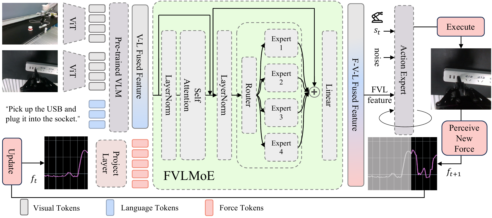
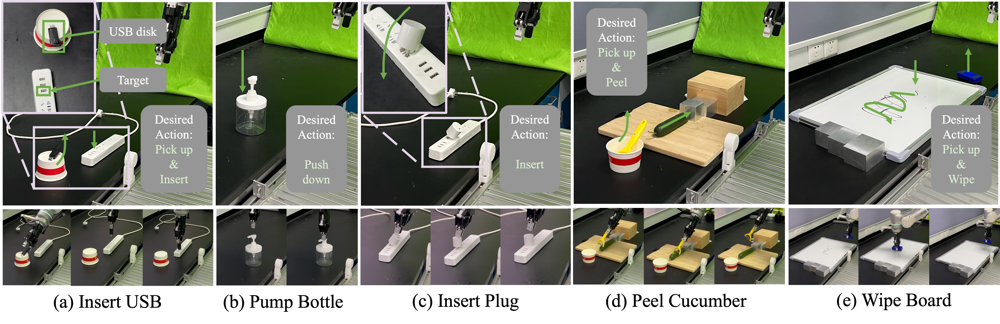
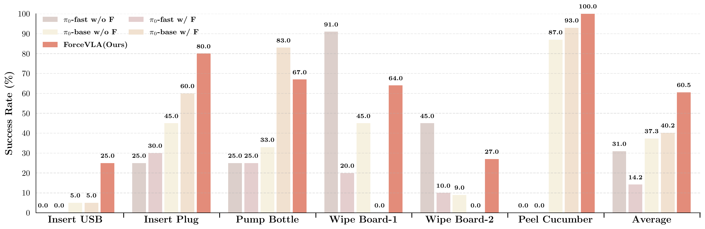
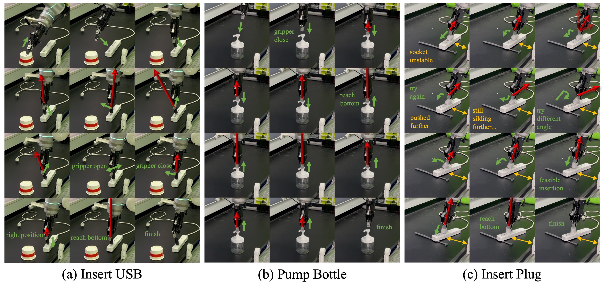

# ForceVLA 慢读笔记

原文 PDF：[papers/pdfs/2505.22159-ForceVLA.pdf](../pdfs/2505.22159-ForceVLA.pdf) · 项目主页：<https://sites.google.com/view/forcevla2025/>

## 一句话概括

ForceVLA 和 [[2509.07962-TA-VLA|TA-VLA]] 一样都搭在 **π₀** 上、都在解决"怎么把力塞进预训练 VLA",但走的是**另一条路**:它把**外置 6 轴力/力矩(wrench)当成一等模态**,核心是一个叫 **FVLMoE(Force-Vision-Language Mixture-of-Experts)** 的融合模块——先让预训练 VLM 处理完视觉+语言,再把力 token 和 V-L 特征拼在一起,过一层 self-attention + **稀疏 MoE(4 个专家、top-1 路由)**做深度融合,融合出的 guidance 再**逐元素加**到 action expert 的 state+动作输入上去指导 flow matching 去噪。5 个接触密集任务(压瓶、插插头、插 USB、擦白板、削黄瓜)上平均成功率 **60.5%**,比 π₀+力(直接拼接)的 40.2% 高 20 个百分点,证明"**力怎么融比有没有力更重要**"。

> **和 TA-VLA 的核心张力**:TA-VLA 说"力矩和关节角是一家人,该进 decoder 跟本体感受一起";ForceVLA 说"力该和视觉-语言在 MoE 里深度融合"。两篇结论都指向**晚融合(late fusion)**——力要在 VLM 处理完之后再进,别污染预训练表征——但**融合对象**一个偏本体感受、一个偏视觉语言。见第 5 节对照。

## 阅读路线图

1. **Introduction** — VLA 在接触密集任务(视觉遮挡、动态不确定)下的短板,力是缺失的模态
2. **Related Work** — VLA、力/触觉模仿学习、MoE
3. **Preliminary** — π₀ 的 flow matching 基础
4. **Method(核心)**:
   - Overview:π₀ + 6 轴力 + FVLMoE
   - **FVLMoE 架构**:力 token 投影 → 和 V-L 特征拼接 → self-attention → 稀疏 MoE(E=4, top-1) → 残差 → 线性投影
   - **注入 action head**:取最后 H_action 个 token 作 guidance,与 VLM 处理的 state+noisy action **逐元素相加**
   - **数据集 ForceVLA-Data**:Flexiv Rizon 7-DOF,244 条轨迹,140k 步
5. **Experiments**:主结果、泛化(5 setting)、消融(融合位置/方式)、可视化重试
6. **Conclusion**

关键图表:**Fig.1 pipeline(架构核心)**、Fig.2 五任务、Fig.3 主结果柱状图、Fig.4 轨迹重试、消融表(融合位置)、泛化表。

---

## 1. 问题背景:力是 VLA 缺的那一块

VLA(π₀、RT-2、OpenVLA 等)靠大规模视觉-语言预训练拿到了强泛化,但**接触密集任务**上翻车,原因和 [[2411.15753-FoAR|FoAR]]、TA-VLA 讲的一致:

- **视觉遮挡**:插 USB、插插头时,插头/端口被夹爪和手挡住,视觉读不出"对没对准"。
- **动态不确定**:削黄瓜、擦白板需要持续调节接触力,纯视觉给不出这个闭环。

ForceVLA 的立场:把**外置 6 轴力/力矩传感器**读到的 wrench `f_raw ∈ ℝ⁶` 当成和视觉、语言并列的一等模态。注意它和 TA-VLA 的**力来源不同**——TA-VLA 用电机电流反算的关节力矩(无传感器),ForceVLA 用的是 Flexiv Rizon 机械臂末端的 6 轴力/力矩(真传感器)。

---

## 2. 方法:FVLMoE 融合模块

先讲清楚数据流(以图为准,从左到右):

**① 视觉-语言分支(照搬 π₀)**:多路 RGB 图各过 ViT,和语言 token 一起进 **预训练 VLM(PaliGemma/SigLIP)**,产出 **V-L Fused Feature** `E_VL ∈ ℝ^{N_VL×D}`。

**② 力分支**:当前帧力读数 `f_t ∈ ℝ⁶` 过一个线性 **Project Layer** `φ_F`,变成一个 **力 token** `E_F = φ_F(f_raw) ∈ ℝ^D`。

**③ FVLMoE 融合(核心)**:把力 token 拼到 V-L 特征后面,`E_in = [E_VL ; E_F] ∈ ℝ^{(N_VL+1)×D}`,然后:

1. **共享精炼层**:`E_in` 过 LayerNorm + **多头 self-attention** + FFN,让力、视觉、语言 token 充分交互,得到 `E_enc`。
2. **稀疏 MoE 层**:`E_enc` 进入一个含 **E=4 个专家**(每个是独立 MLP)的稀疏 MoE;一个门控网络给每个 token **只选 1 个专家(top-k=1)**。
3. **残差 + 线性投影**:MoE 输出残差连接回输入得 `E_fused`,再过线性层对齐 action expert 的维度。

**④ 注入 action flow head**:从 FVLMoE 输出里取**最后 H_action 个 token** 作 guidance `G_FVLMoE ∈ ℝ^{H_action×D_a}`,与 VLM 处理"当前本体状态 `s_t` + 加噪动作 `a_t^τ`"得到的 suffix `S_suffix` 做**逐元素相加**,在 flow matching 的每一步去噪里调制动作。

**⑤ 闭环**:执行动作 → 感知新力 `f_{t+1}` → 回灌下一步(图右下的 Perceive New Force 回路)。

### 为什么这样设计?两个关键决定

- **力在 VLM 之后进(晚融合)**:作者把 FVLMoE 比作"高级皮层联合区"——先让 VLM 用好它预训练的视觉-语言能力,再引入力。**在 VLM 之前动它的输入表征会破坏预训练知识**(消融里 "MoE before VLM" 直接 0% 成功,见第 5 节)。
- **用 MoE 而非简单拼接**:MoE 的专家层天然适合学**模态特异**的表征和划分,让不同模态/token 路由到不同专家,比"一把拼接"更能挖掘力-视觉-语言的交互。

---

## 3. 数据集 ForceVLA-Data

- **硬件**:Flexiv Rizon 7-DOF 机械臂(自带末端 6 轴力/力矩感知)+ Dahuan 自适应夹爪。
- **相机**:1 个第三人称 RealSense D435(1280×720@30)+ 1 个腕部 D415(640×480@30)。
- **采集**:Quest3 VR 遥操,5 名操作员,5 个接触密集任务。
- **规模**:**244 条轨迹,~14 万同步时间步**;动作表示为末端 TCP 位姿 + 夹爪宽度。数据和代码承诺开源。

---

## 4. 五个任务

- **Bottle Pumping(压瓶)**:把液体瓶顶部的按压泵压到底。靠力判断"泵到底了没"。
- **Plug Insertion(插插头)**:把电源插头插进插排(随机位姿),需要力控对准+插入。
- **USB Insertion(插 U 盘)**:抓起 U 盘竖直插入端口,精对准。
- **Whiteboard Wiping(擦白板)**:抓板擦擦掉标记,需持续贴合表面。两个指标:Wipe-1=完成擦拭动作,Wipe-2=完全擦净。
- **Cucumber Peeling(削黄瓜)**:抓削皮器削黄瓜皮,持续维持受控接触力,每轮 15 刀。

每任务约 **50 条示教**;插入/压瓶各评 20 次,擦白板 10 次,削黄瓜 15 次(每次 15 刀)。

---

## 5. 实验

### 主结果:力怎么融比有没有力更重要

各任务成功率(%),`w/ F` = 力直接拼接到 state:

| 任务 | π₀-fast w/o F | π₀-fast w/ F | π₀-base w/o F | π₀-base w/ F | **ForceVLA** |
|---|---|---|---|---|---|
| Insert USB | 0 | 0 | 5 | 5 | **25** |
| Insert Plug | 25 | 30 | 45 | 60 | **80** |
| Pump Bottle | 25 | 25 | 33 | **83** | 67 |
| Wipe Board-1 | **91** | 20 | 45 | 0 | 64 |
| Wipe Board-2 | 45 | 10 | 9 | 0 | **27** |
| Peel Cucumber | 0 | 0 | 87 | 93 | **100** |
| **平均** | 31.0 | 14.2 | 37.3 | 40.2 | **60.5** |

- **ForceVLA 平均 60.5%**,比 π₀-base w/o F(37.3%)高 23.2,比 π₀-base w/ F(40.2%)高 20.3。
- **关键论点**:π₀ 直接拼力只从 37.3→40.2(仅 +2.9),而 FVLMoE 拉到 60.5。**光给力没用,得会融**。
- π₀-fast 对力**极其敏感**:加力反而从 31.0 崩到 14.2(紧凑 token 空间被裸投影的力 token 打乱),所以作者选 π₀-base 当底座。
- 唯一 ForceVLA 不占优的是 Pump Bottle(67 vs π₀-base w/ F 的 83)和 Wipe-1(64 vs π₀-fast 的 91),但那些 baseline 在别的任务上崩得厉害,不稳定。

**削黄瓜精细指标**:平均每刀削皮长度 ForceVLA **14.12cm**(π₀-base w/ F 13.17,w/o F 10.27);削到"基本削净"所需最少刀数 ForceVLA **7 刀**(w/ F 10,w/o F 14)。

### 泛化(5 种扰动)

| 模型 | Object Gen.1 | Object Gen.2 | Height Gen. | Visual Occlusion | Unstable Socket | 平均 |
|---|---|---|---|---|---|---|
| π₀-base w/o F | 48 | 10 | 66.67 | 60 | 10 | 38.93 |
| π₀-base w/ F | 32 | 10 | 77.78 | 30 | 10 | 31.96 |
| π₀-fast w/o F | **80** | 35 | **88.89** | 50 | 10 | 52.78 |
| π₀-fast w/ F | 32 | 5 | 44.44 | 50 | **30** | 32.29 |
| **ForceVLA** | **80** | **40** | **88.89** | **90** | 20 | **63.78** |

亮点:**视觉遮挡下 ForceVLA 90%**(其他最高 60%),因为它能靠力反馈补上被遮挡的视觉;Height Gen. 里靠力感知"压到底"而不超力矩限。

### 消融:融合放哪 + 怎么融(全文最有信息量的表)

| 方案 | 成功率 |
|---|---|
| baseline(π₀,无力) | 45% |
| linear before VLM(力在 VLM 前做线性调制视觉 token) | 55% |
| **MoE before VLM**(力在 VLM 前和视觉 token 过 MoE) | **0%** |
| concat after VLM(力在 VLM 后简单拼接 = π₀+力) | 60% |
| **ForceVLA(FVLMoE,VLM 后 MoE 融合)** | **80%** |

两条结论:
1. **力必须在 VLM 之后进**:VLM 前动输入表征会毁掉预训练知识,"MoE before VLM" 直接 0%。
2. **精细融合 > 简单拼接**:同是晚融合,FVLMoE(80%)比 concat(60%)高 20 个点。

> **对照 TA-VLA 的 where-to-embed 消融**:TA-VLA 也做过一模一样立意的实验,结论是"进 decoder 别进 encoder";ForceVLA 是"VLM 后别 VLM 前"。两者本质都在说**别碰预训练 VLM 的前端表征,力要晚融**。差别在:TA-VLA 把力和**本体感受(关节角)**在 action expert 里对齐融合(还给了 HSIC 证据说力矩↔角=0.957);ForceVLA 把力和**视觉-语言**在 MoE 里融合。这是两种可以并存、但出发点不同的 late-fusion 哲学。

### 可视化:靠力重试

USB 插入斜了导致接触失败时,ForceVLA 会**重新定向、甚至松开重抓**换个角度再插;插排被垫不稳而移位时,夹爪**顺应地跟着插头位移**、最后找到稳定位形插进去。baseline 则反复以错误位姿硬怼、甚至施加过大力。

---

## 6. 局限与判断

**我的判断(非论文结论)**:
- ForceVLA 和 TA-VLA 是"力进 VLA"的**最佳对照对**:同底座(π₀)、同结论方向(晚融合),但融合机制(MoE-融视觉语言 vs 单token-融本体感受)、力来源(外置 wrench vs 无传感器关节力矩)、辅助任务(无 vs 预测未来力矩)都不同。合起来能拼出这个子方向的设计空间。
- 全部真机、每任务仅 ~50 条示教、评测次数少(10~20 次),统计噪声不小;但主结论(60.5 vs 40.2、消融 80 vs 60 vs 0)差距够大。
- MoE 只有 4 专家 top-1,论文正文把"专家是否真的按模态分工"的路由可视化(router 图)注释掉了,这部分证据偏弱。
- 用外置 6 轴力传感器 → 精度高但成本高、且很多平台没有;TA-VLA 的无传感器路线在这点上更省。

### 与已读力控笔记的关系

| 维度 | [[2411.15753-FoAR\|FoAR]] | [[2509.07962-TA-VLA\|TA-VLA]] | **ForceVLA(本文)** |
|---|---|---|---|
| 底座 | RISE(从头训) | 预训练 π₀/RDT | 预训练 π₀ |
| 力来源 | 外置 6 轴 F/T | 电机电流反算关节力矩 | 外置 6 轴 F/T |
| 融合机制 | 接触概率 φ 门控 | decoder 单 token + 预测未来力矩 | **FVLMoE(MoE 融视觉语言)** |
| 核心结论 | 力是稀疏激活,按需门控 | 力进 decoder / 单 token / 预测未来 | 力晚融(VLM 后)+ 会融比有力更重要 |

参见 [[具身力控]] 主题笔记。
