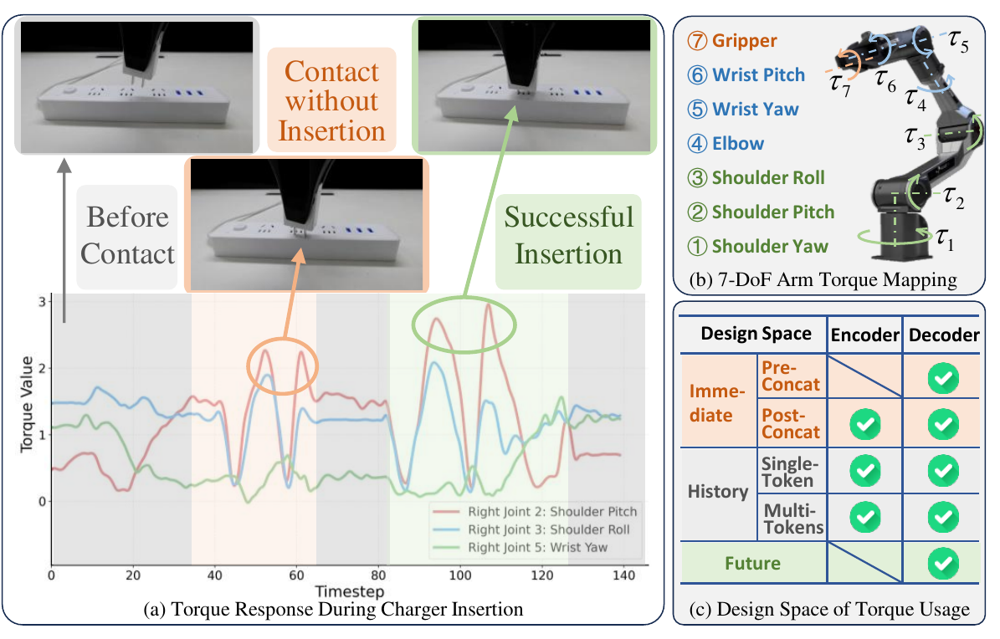
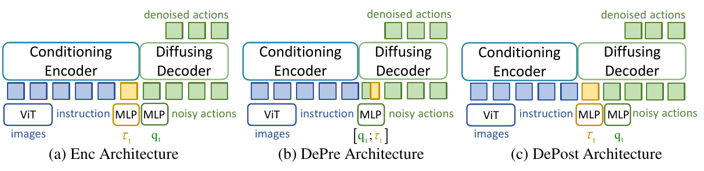
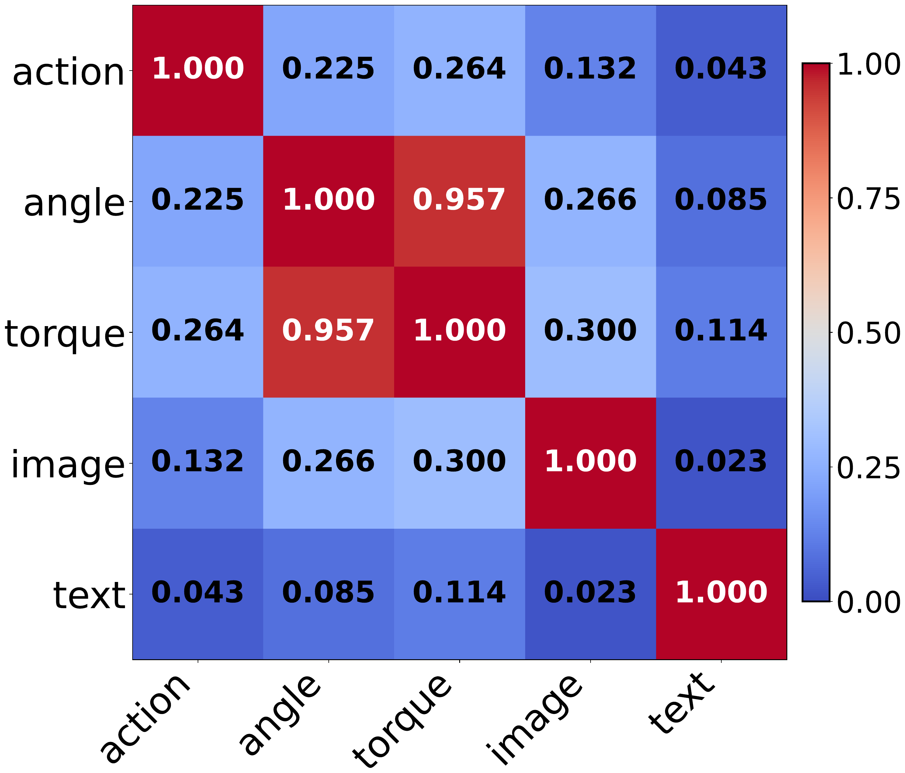
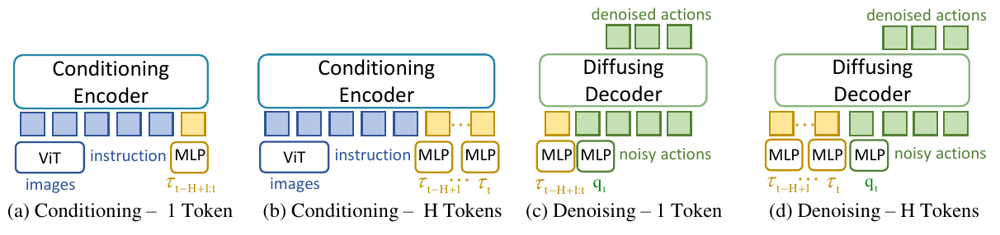
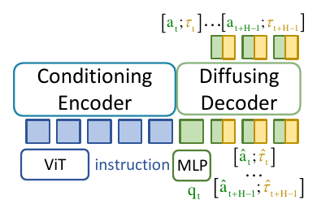
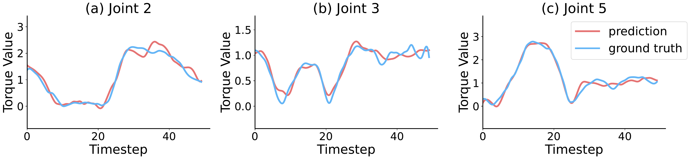
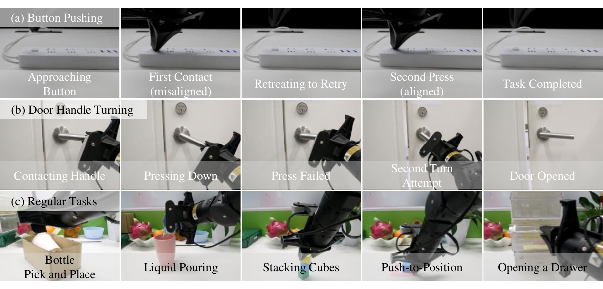

# TA-VLA 慢读笔记

原文 PDF：[papers/pdfs/2509.07962-TA-VLA.pdf](../pdfs/2509.07962-TA-VLA.pdf) · 项目主页：<https://zzongzheng0918.github.io/Torque-Aware-VLA.github.io/> · CoRL 2025

## 一句话概括

TA-VLA 不加任何外置力/力矩传感器,只用**电机电流反算出来的关节力矩(joint torque)**,系统性地回答"力矩信号该怎么塞进一个预训练好的 VLA(主用 π₀)"这个工程问题。它把设计空间拆成三个轴——**何时(immediate / history / future)、放哪(encoder 还是 decoder)、怎么放(单 token 还是多 token)**——然后用真机实验一格一格地测,得到三条可迁移的结论:(1) 力矩要进 **decoder(action expert),不要进 encoder**,因为力矩和关节角一样是本体感受(proprioceptive)信号,而 decoder 对细微输入变化更敏感;(2) **历史力矩比单帧更有用,但要压成一个 token** 塞进 decoder,多 token 会破坏 decoder 预训练学到的输入模式;(3) 借鉴自动驾驶的"联合预测+规划",让模型在输出动作的同时**顺便预测未来力矩**(action-torque 联合 diffusion),逼它建立起对接触动力学的物理化内部表征。最终 `π₀+obs+obj` 在 5 个接触密集任务上从 π₀ 的个位数成功率飙到 15–18/20,且能迁移到 RDT 和另一款机械臂(ROKAE SR)。

## 阅读路线图

论文正文很短(CoRL 8 页),但把"消融即论证"贯彻到底。结构:

1. **Introduction** — 用充电器插拔的力矩曲线说明"力矩能区分成败",并抛出三轴设计空间(Fig.1c)
2. **§3 Torques are Good Indicators** — 理论:关节力矩如何通过 Jacobian 转置编码末端接触力(为什么力矩=廉价力觉)
3. **§4 Sense What Was: Torques as Observations** — 力矩当**输入**:
   - §4.1 **Where to Embed**(放哪):Enc / DePre / DePost 三种架构 + HSIC 对齐分析 + decoder 敏感性
   - §4.2 **History**(怎么放历史):单 token vs 多 token,encoder vs decoder
4. **§5 Predict What will Be: Torques as Objectives** — 力矩当**监督目标**:action-torque 联合 diffusion
5. **§6 Experiment** — 10 任务(5 接触密集 + 5 常规)主结果、可视化重试、跨模型(RDT)、跨本体(ROKAE)
6. **Conclusion / Limitations** — 依赖电流估力矩的脆弱性、能否扩展到触觉/温度等模态
7. **Appendix** — 7-DoF 完整 Jacobian 推导、各实验协议、β 消融、聚合方式(MLP/RNN/Attn)消融、效率

**图表地图**(本笔记会在对应位置贴出):

| 图/表 | 说明什么 | 出现在 |
|---|---|---|
| **Fig.1 Teaser** | 力矩曲线区分"未接触/失败/成功" + 7-DoF 力矩映射 + **三轴设计空间矩阵** | 第 1、3 节 |
| **Fig.2 where_embed** | Enc / DePre / DePost 三种嵌入架构 | 第 4 节(放哪) |
| **Fig.3 HSIC** | 五模态两两相关性,torque↔angle=0.957 | 第 4 节(为什么进 decoder) |
| **Fig.4 history** | 历史力矩的 4 种嵌入(编码器/解码器 × 单/多 token) | 第 4 节(历史) |
| **Fig.5 future** | action-torque 联合 diffusion 架构 | 第 5 节 |
| **Fig.6 eff_pred** | 预测未来力矩 vs ground truth | 第 5 节 |
| **Fig.7 visualization** | 真机上靠力矩感知失败并自动重试 | 第 6 节 |
| Table 主结果 / 各消融 | 成功率数字 | 第 6、8 节 |

---

## 1. 问题背景:关节力矩是"免费的力觉",但 VLA 用不上它



先看 Fig.1(a) 这条充电器插拔的力矩曲线,它是整篇论文的直觉来源:

- **灰色阴影段 = 未接触**:力矩几乎是平的。
- **橙色段 = 接触了但没插进去(失败)**:只有小幅力矩波动。
- **绿色段 = 成功插入**:出现又大又尖的力矩尖峰(插头到位的瞬间)。

关键点:这三种结果**在 RGB 图像上几乎看不出区别**(插头挡住了,视觉被遮挡),但**关节力矩曲线一眼能分**。这正是纯视觉 VLA(π₀、RDT、ACT 等)在接触密集任务上的短板——它们没有力反馈这条通道,分不清"贴上去了没插进"和"插到位了"。

这篇论文和很多力控工作最不一样的一点在数据来源(§6 Setup):**它不用外置 6 轴力/力矩传感器**,而是直接从每个电机的**驱动电流**反算力矩:

```
τ = k_t · i
```

- `τ` = 关节力矩,`i` = 电机电流,`kₜ` = 每个电机的电流-力矩常数(current-to-torque constant,厂商给)。
- **直觉**:电机推着关节动,要对抗外部接触力就得多出电流,电流里就藏着力信息。所以**只要读电机电流,就能实时估出关节力矩,不花一分钱加传感器**。这也是标题里 "torque" 而不是 "force" 的原因——它用的是关节空间的力矩,不是末端的 6D wrench。

> **和 [[2411.15753-FoAR]] 的对照**:FoAR 用的是外置高频 F/T 传感器 + 从头训 RISE 策略;TA-VLA 用的是无传感器的关节力矩 + 往**预训练 VLA** 上打补丁。两者都在解决"接触密集任务缺力觉",但成本假设和落点(from scratch vs 微调大模型)完全不同。

Fig.1(c) 是全文的骨架——**力矩使用的设计空间**,三个轴:

- **When(何时)**:用当前帧(Immediate)、历史窗口(History)、还是预测未来(Future)?
- **Where(放哪)**:塞进 conditioning **encoder**,还是 denoising **decoder**?
- **How(怎么放)**:压成单 token(Single-Token),还是每帧一个 token(Multi-Tokens)?

矩阵里的绿勾表示"这个组合本文测过"。全文剩下的部分就是逐格实验,最后拼出最优配置:**当前+历史力矩 → 压成单 token → 进 decoder;再让 decoder 顺带预测未来力矩**。

---

## 2. 理论:关节力矩为什么等价于一种"力觉"(§3)

这一节回答"凭什么电机电流里能读出末端接触力"。从机械臂全身动力学出发:

$$\boldsymbol{M}(\boldsymbol{q})\ddot{\boldsymbol{q}} + \boldsymbol{C}(\boldsymbol{q},\dot{\boldsymbol{q}})\dot{\boldsymbol{q}} + \boldsymbol{G}(\boldsymbol{q}) = \boldsymbol{\tau}_{\text{cmd}} + \boldsymbol{\tau}_{\text{ext}}$$

- `M(q)` 惯性矩阵、`C(q,q̇)` 科氏/离心项、`G(q)` 重力项——这些是机械臂自身动力学。
- `τcmd` 是控制器发的指令力矩,`τext` 是**外部接触力在关节空间的贡献**。

末端受到的空间力(wrench)`Fext ∈ ℝ⁶` 通过 Jacobian 转置投影回关节空间:

$$\boldsymbol{\tau}_{\text{ext}} = \boldsymbol{J}^\top(\boldsymbol{q})\,\boldsymbol{F}_{\text{ext}}$$

- `J(q) ∈ ℝ^{6×n}` 是 Jacobian,把关节速度映射到末端速度;它的转置 `Jᵀ` 就把末端力映射回关节力矩。
- **这是全节的核心**:末端只要受力,就会沿运动学链在每个关节上留下力矩痕迹。

于是测得的力矩可分解为:

$$\boldsymbol{\tau}_{\text{measured}} = \boldsymbol{\tau}_{\text{model}} + \boldsymbol{J}^\top(\boldsymbol{q})\,\boldsymbol{F}_{\text{ext}}$$

- `τmodel` 是"没有接触时按动力学模型该有的力矩",`Jᵀ Fext` 是接触带来的额外部分。
- **直觉**:把模型预测的力矩减掉,剩下的残差就直接反映外部接触力——这就是**无传感器力估计 / 碰撞检测 / 柔顺控制**的理论基础。

附录进一步把这个 mapping 具体到 7-DoF 臂,并给出一个很实用的结论:**夹爪那一维(q₇)对末端 TCP 受力不敏感**,因为夹爪开合不改变 TCP 位姿,对应的 Jacobian 列 `J_grip = 0`,所以 `τext,7 = 0`。真正携带接触信息的是**臂的前 6 个关节**(肩、肘、腕)。准静态(低速)近似下 `τmeasured ≈ G(q) + Jᵀ Fext`,减掉重力项 `G(q)` 就得到接触残差。

---

## 3. 力矩当"输入":放哪?(§4.1 Where to Embed)

先厘清 VLA 的两段式结构(以 π₀ 为例):

- **Conditioning Encoder(编码器)**:吃多张 RGB 图 `I` + 语言指令 `L`,负责**感知环境**,产出条件表征。π₀ 里用 PaliGemma 3B。
- **Denoising Decoder / Action Expert(解码器)**:吃机器人本体状态 `qₜ`(关节角)+ 加噪动作块,通过去噪(π₀ 用 Conditional Flow Matching)**生成动作序列**。π₀ 里是 300M 的 action expert。

原始 π₀ 的分工:图像+语言进 encoder 当条件,关节角 `qₜ` 当一个 token 进 decoder。**那力矩 `τₜ` 该往哪塞?** 作者测了三种(Fig.2):



- **(a) Enc(编码器嵌入)**:力矩过一个 MLP adapter 变成一个 token,和图像/语言 token 拼在一起当额外条件。
- **(b) DePre(解码器-前拼接)**:把 14 维关节力矩直接塞进 `qₜ` 状态向量的零填充位(π₀ 状态是 14 维关节角 + 18 维零填充),和 `qₜ` 合成**同一个** token。
- **(c) DePost(解码器-后拼接)**:力矩过 adapter 变成一个**独立 token**,拼在 action expert 的状态输入前面。

**结果(两个接触密集任务,各 20 次):**

| 任务 | π₀ | Enc | DePre | **DePost** |
|---|---|---|---|---|
| Button Pushing | 5/20 | 7/20 | 8/20 | **10/20** |
| Charger Plugging | 0/20 | 8/20 | 11/20 | **12/20** |

结论:**进 decoder > 进 encoder;独立 token(DePost) > 混进原状态(DePre)**。作者给了两条解释,而且都用实验坐实:

### 3.1 更好的输入对齐(为什么进 decoder 而非 encoder)

力矩 `τₜ` 和关节角 `qₜ` 同属**本体感受信号**,天然高度相关(比如接触时二者的一致性/冗余)。作者用 **Normalized HSIC**(希尔伯特-施密特独立性判据,一种能测非线性相关、0~1 归一化的指标)测了五种模态中间层特征的两两相关:



读这张图只看 `torque` 那一行/列:

- **torque ↔ angle(关节角)= 0.957** — 极高,几乎同源。
- torque ↔ image = 0.300,torque ↔ text = 0.114 — 很低。

既然力矩和关节角是"一家人",就该和关节角在**同一个地方(decoder)融合**,才能利用它们的相关性;塞进 encoder 反而和图像/语言这些不相关的东西硬凑。(HSIC 实验细节:在 Button Pushing 上训好的 DePost 模型,取 transformer 第 12 层输出,每模态下采样到 32 个 token,用 RBF 核算。)

### 3.2 Decoder 对细微变化更敏感

encoder 面对的是多样、模糊的视觉-语言输入,学的是**粗粒度**特征;decoder 是为了在去噪时捕捉**细微输入变化**而设计的。作者往 encoder / decoder 的输入 token 分别加**标准差 0.1 的高斯噪声**,看谁掉得多:

| 任务 | π₀ | Enc-Noised | Dec-Noised |
|---|---|---|---|
| Bottle Pick and Place | 14/20 | 12/20 | 8/20 |
| Button Pushing | 5/20 | 4/20 | 0/20 |

decoder 被加噪后掉得更狠 → 说明 **decoder 对输入变化更敏感**。反过来,这种敏感性正好用来**捕捉力矩里那些细微但关键的波动**(区分失败/成功的小尖峰)。这也解释了 DePre 为何不如 DePost:DePre 直接改动了原始 `qₜ` token,相当于给敏感的 decoder 又加了噪声。

---

## 4. 力矩当"输入":历史怎么放?(§4.2 History)

单帧力矩不够——接触时力矩剧烈变化,而视觉因遮挡几乎不变,所以**历史力矩窗口**能提供更丰富的交互模式。问题是:历史该压成一个 token 还是每帧一个 token?放 encoder 还是 decoder?四种组合(Fig.4):



- (a) Conditioning-1 Token:整段历史压成 1 个 token 进 encoder
- (b) Conditioning-H Tokens:每帧 1 个 token(共 H 个)进 encoder
- (c) **Denoising-1 Token**:整段历史压成 1 个 token 进 decoder ← 最终选择
- (d) Denoising-H Tokens:每帧 1 个 token 进 decoder

**结果:**

| 任务 | π₀ | Enc-1 | Enc-H | **Dec-1** | Dec-H |
|---|---|---|---|---|---|
| Button Pushing | 5/20 | 1/20 | 4/20 | **15/20** | 9/20 |
| Charger Plugging | 0/20 | 3/20 | 6/20 | **16/20** | 7/20 |

**Dec-1(单 token 进 decoder)大幅领先**。注意一个反直觉的对比:在 **decoder** 里单 token(Dec-1=15)反而胜过多 token(Dec-H=9),而在 **encoder** 里多 token(Enc-H)略胜单 token(Enc-1)。原因是:

### 输入模式完整性(Input Pattern Completeness)

decoder 在预训练时学到了固定的输入 token 模式,**塞进一堆历史 token 会破坏这个模式**。作者做了个干净的验证——往 encoder / decoder 分别插一个**纯高斯噪声 token**(形状和其他 token 一样),看扰动影响:

| 任务 | π₀ | Enc-Disrupted | Dec-Disrupted |
|---|---|---|---|
| Bottle Pick and Place | 14/20 | 13/20 | 8/20 |
| Button Pushing | 5/20 | 5/20 | 2/20 |

- **decoder 一加额外 token 就崩**(Button 5→2),**encoder 几乎不受影响**(5→5)。
- 所以对 decoder 而言,即便单 token 会损失一些信息,"不破坏输入模式"的收益压过了"多帧信息量"的损失 → 单 token 胜。
- 对 encoder 而言,它对 token 数量鲁棒、又能吃进更多信息,所以多 token 略好;但 encoder 这条路整体仍输给 decoder(因为 §3 的对齐+敏感性优势)。

**历史窗口细节(附录)**:从过去 2 秒里**均匀采 10 帧**(含当前帧)。单 token 做法 = 把 10 帧 × 14 维 = 140 维拉平,过一个 MLP 压成一个 token。聚合方式消融(附录):**MLP > Attention > RNN**,作者归因于微调数据有限,复杂序列模型(RNN/Attn)容易欠拟合,简单 MLP 参数高效。

---

## 5. 力矩当"监督目标":预测未来力矩(§5 Action-Torque Diffusion)

前两节把力矩当**观测(obs)**塞进去。这一节更进一步:让模型在生成动作的同时**顺便预测未来的力矩(obj)**。灵感来自自动驾驶里的"联合预测+规划"(MTR)——不光决定要做什么动作,还要预判这个动作会带来什么物理后果。



做法很轻量。设动作块 `Aₜ ∈ ℝ^{H×dₐ}` 和力矩块 `Tₜ ∈ ℝ^{H×dτ}`,把它们拼成联合 token:

$$\boldsymbol{Z}_t = [\boldsymbol{A}_t;\,\boldsymbol{T}_t], \qquad \boldsymbol{Z}_t^{\alpha} = \alpha\,\boldsymbol{Z}_t + (1-\alpha)\,\boldsymbol{\epsilon}$$

- 采高斯噪声 `ε` 和时间步 `α∈[0,1]`,构造带噪输入 `Zₜ^α`(沿用 π₀ 的 flow matching)。
- 模型输出向量场 `vθ`,分别对动作段和力矩段算 MSE(flow matching 的回归目标是 `ε - 干净值`):

$$\mathcal{L}_{\text{action}} = \mathbb{E}\big\|\,\boldsymbol{v}_\theta(\boldsymbol{Z}_t^\alpha, o_t)_A - (\boldsymbol{\epsilon}_A - \boldsymbol{A}_t)\,\big\|_2^2, \qquad \mathcal{L}_{\text{torque}} = \mathbb{E}\big\|\,\boldsymbol{v}_\theta(\boldsymbol{Z}_t^\alpha, o_t)_T - (\boldsymbol{\epsilon}_T - \boldsymbol{T}_t)\,\big\|_2^2$$

$$\mathcal{L}_{\text{joint}} = \mathcal{L}_{\text{action}} + \beta\,\mathcal{L}_{\text{torque}}$$

- `vθ(·)_A / vθ(·)_T` 是模型输出里动作段/力矩段的分量,`εA / εT` 是噪声对应切片。
- **关键的省钱设计**:不新建预测头,而是**把原来动作输出的那个线性层维度扩宽**,一次吐出"动作+力矩"拼接的向量,再切开算各自的 loss。加载预训练权重时,原动作维度用预训练值,新增力矩维度用小值初始化,尽量不扰动原行为,让它在微调中慢慢学。
- `β` 平衡动作精度和力矩精度。**未来预测长度 H=50**,和动作 chunk 一样长。

**为什么有用**:让模型学"动作 → 力矩响应"的因果关系,等于在潜空间里内化了接触动力学。Fig.6 验证了模型确实能预测未来力矩:



三个关节(Joint 2/3/5)上,预测曲线和真值高度吻合,说明模型真的"预感"到了未来的力变化——这个能力反过来帮它生成更好的动作。

**β 取值(附录消融,Button Pushing)**:
- 只加目标 `π₀+obj`:β 从 0.01(6/20)升到 0.2~1 达到平台,取 **β=1**。
- 观测+目标 `π₀+obs+obj`:峰值 18/20 出现在低 β,高 β 反而掉,取 **β=0.1**(此时要平衡新引入的两个组件:辅助 loss 和力矩观测模态)。

---

## 6. 实验:三个变体,10 个任务

**硬件**:Cobot Magic ALOHA 双臂机器人,每臂 7-DoF,3 个 D435 深度相机(双腕 + 前置)。力矩由电机电流反算(§1)。
**Baselines**:ACT、RDT、π₀,全部从公开预训练权重在自采数据上微调(每任务 400 条遥操作示教)。
**三个变体**:
- `π₀+obs` = 用 DePost-单 token 塞入"当前+历史"力矩观测
- `π₀+obj` = 用 action-torque 联合 diffusion 目标
- `π₀+obs+obj` = 两者结合(最终模型)

### 主结果(每格 20 次试验)

**接触密集任务(力矩关键):**

| 方法 | Button Pushing | Charger Plugging | USB Plugging | Socket Unplugging | Door Handle Turning |
|---|---|---|---|---|---|
| ACT | 2/20 | 0/20 | 0/20 | 12/20 | 0/20 |
| RDT | 4/20 | 1/20 | 0/20 | 10/20 | 0/20 |
| π₀ | 5/20 | 0/20 | 0/20 | 16/20 | 2/20 |
| π₀+obs | 15/20 | 16/20 | 15/20 | **19/20** | 13/20 |
| π₀+obj | 11/20 | 10/20 | 12/20 | **19/20** | 12/20 |
| **π₀+obs+obj** | **18/20** | **17/20** | **17/20** | **19/20** | **15/20** |

**常规任务(力矩看似无关):**

| 方法 | Bottle Pick&Place | Liquid Pouring | Stacking Cubes | Push-to-Position | Opening a Drawer |
|---|---|---|---|---|---|
| ACT | 15/20 | 13/20 | 12/20 | 13/20 | 16/20 |
| RDT | 17/20 | **17/20** | 12/20 | 15/20 | 16/20 |
| π₀ | 17/20 | 16/20 | 17/20 | 16/20 | **19/20** |
| π₀+obs | 18/20 | 16/20 | **18/20** | 16/20 | **19/20** |
| π₀+obj | 17/20 | 16/20 | 17/20 | 16/20 | 18/20 |
| **π₀+obs+obj** | **19/20** | **17/20** | 17/20 | **18/20** | 18/20 |

**读数**:
- 接触密集任务上提升是**碾压式**的:π₀ 在 Charger/USB Plugging 上是 0/20(纯视觉根本插不进),加力矩后到 15~17/20。
- obs 和 obj **各自都有用,合起来最好**;obs 单独通常比 obj 单独更强。
- 力矩连**常规任务也小幅受益**(Bottle 17→19、Push 16→18),说明本体感受增强是普适的,不只对接触任务。
- 唯一例外 Socket Unplugging:π₀ 基线已 16/20,三个变体都到 19/20,天花板效应。

### 靠力矩感知失败并自动重试(Fig.7)



这是力矩带来的**闭环行为**,最直观的定性证据:

- (a) Button Pushing:第一次没对准(力矩异常)→ 检测到失败 → 撤回重试 → 第二次对准成功。
- (b) Door Handle Turning:第一次下压失败 → 第二次转动 → 开门。
- (c) 5 个常规任务也能高精度完成。

模型是靠**关节力矩的异常变化**(错位/打滑)判断"这次没成",从而触发重试——纯视觉策略做不到这一点。

### 泛化性:跨模型 & 跨本体

- **跨模型(换到 RDT)**:同样的 obs+obj 策略搬到 RDT 上依旧大涨。Button 4→16、Charger 1→15、Bottle 17→19。说明结论不绑定 π₀。(RDT 里力矩 projector 是两层 MLP+GELU,投到 2048 维,拼在 state token 后。)
- **跨本体(换到 ROKAE SR 机械臂)**:做电动车充电枪插入,`π₀+obs+obj` 用 200 条示教训 50K 步,靠力矩反馈检测失败并二次成功;把快充口换成慢充口后**无需改架构**也能适应。

---

## 7. 工程细节与代价(附录要点)

- **训练**:π₀ 用 LoRA 同时微调 encoder+decoder,30k 步,4×NVIDIA L20;RDT 全参训 40k 步;ACT 训 600 epoch(chunk=32)。推理在板载 RTX 4090。π₀ 推理动作 horizon=50,RDT=64,ACT=8。
- **π₀ 结构**:PaliGemma 3B VLM + 300M action expert,两套权重在同一 transformer 内、仅通过 self-attention 交互;Conditional Flow Matching,10 步积分出动作。
- **效率几乎无损**:推理时间 π₀ 90.70ms → π₀+obs+obj 93.96ms;训练 1.703 → 1.640 s/iter。加力矩基本不增加计算负担。
- **力矩预处理**:用**全部 7 个关节**的力矩(不只末端);夹爪关节对 TCP 受力不敏感(理论上 τ=0);靠近肩部的关节在非接触运动时也会有变化,但**那不是噪声**,且幅度远小于接触信号;每个关节按训练集统计量做归一化(和 state/action 一样)。

---

## 8. 局限与判断

**论文自陈的局限**:
- 依赖从电机电流估力矩,受**电机标定、传感噪声、热漂移**影响,长时间/高负载任务可能退化。
- 能否扩展到触觉、温度等**其他物理模态**尚不清楚,尤其在 transformer 有限 token 预算下。

**我的补充判断(非论文结论)**:
- 这篇的价值不在"提出新模块",而在**把"力矩塞进 VLA"这件事的设计空间量化了**,给出可迁移的经验法则:本体感受信号进 decoder、历史压单 token、加预测辅助头。这些结论对"往预训练 VLA 加任意新本体模态"都有参考意义。
- 全部是**真机成功率**、无仿真、无失败模式深挖;每个消融只在 1~2 个任务上做(样本 20 次),统计噪声不小,DePost vs DePre(10 vs 8)这种差距要谨慎看待——但 Dec-1 vs 其他(15/16 vs 个位数)差距足够大,结论可信。
- "无传感器力矩"是最大卖点也是最大软肋:省了硬件,但把误差源转移到了动力学模型和电流标定上,论文没量化这个估计误差本身。

### 与已读力控笔记的关系

| 维度 | [[2411.15753-FoAR]] | **TA-VLA(本文)** | [[2606.08555-FAWAM]] |
|---|---|---|---|
| 力来源 | 外置 6 轴 F/T 传感器 | **电机电流反算关节力矩(无传感器)** | (力自适应) |
| 基座策略 | RISE(视觉,从头训) | **预训练 VLA(π₀/RDT)微调** | — |
| 力的用法 | 学接触概率 φ 动态加权融合 | **进 decoder 单 token + 预测未来力矩** | — |
| 部署行为 | reactive control 补步 | 靠力矩异常检测失败并重试 | — |
| 定位 | 力融合的融合机制创新 | **力融合的"放哪/怎么放"设计空间研究** | — |

三篇合起来能覆盖"接触密集操作里力信息怎么用"的不同切面。可进一步参见 [[具身力控]] 主题笔记。
