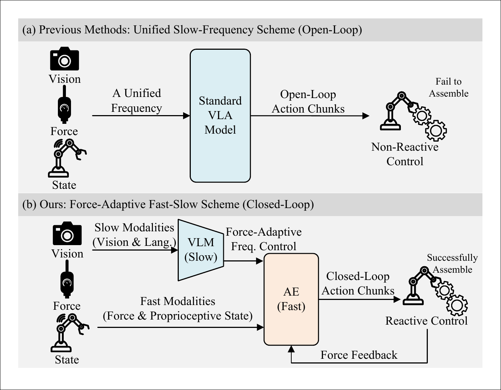
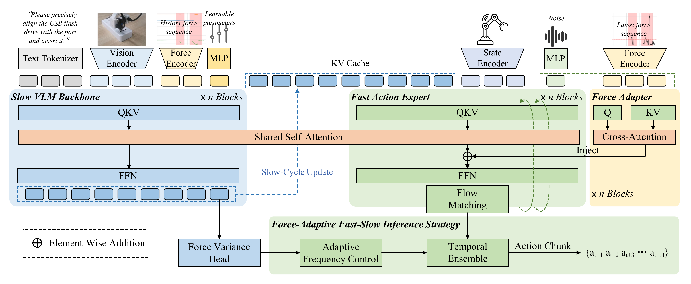
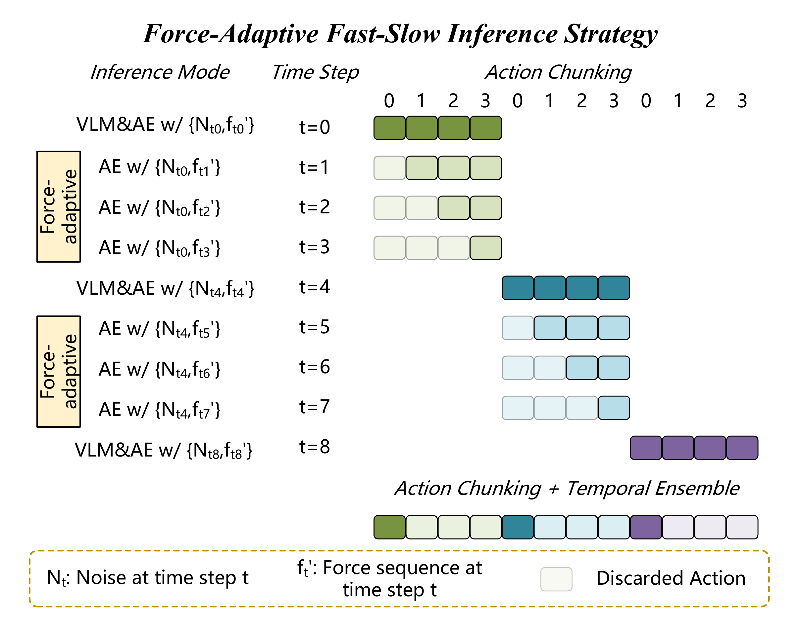
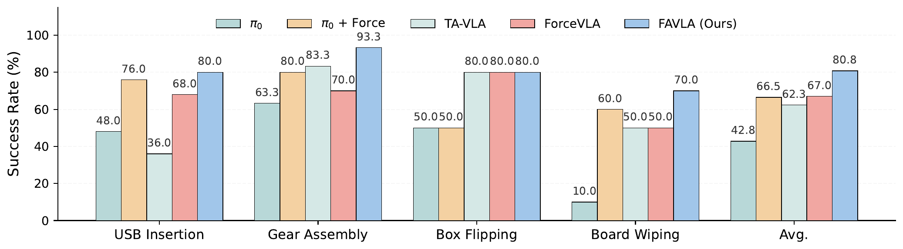
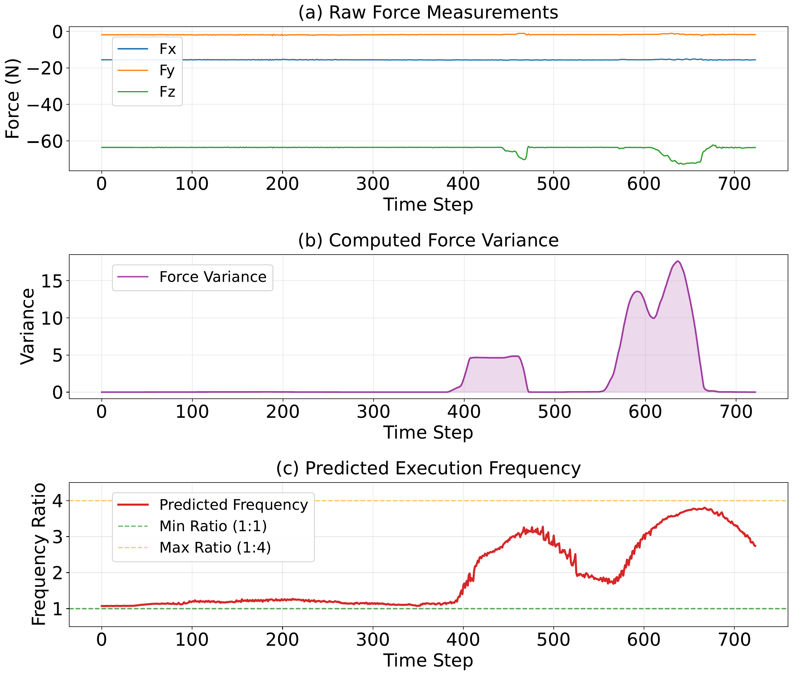

# FAVLA 慢读笔记

原文 PDF：[papers/pdfs/2602.23648-FAVLA.pdf](../pdfs/2602.23648-FAVLA.pdf)

## 一句话概括

前面几篇([[2509.07962-TA-VLA|TA-VLA]]、[[2505.22159-ForceVLA|ForceVLA]])都在解决"力**放哪/怎么融**",但都是**单一频率**融合——所有模态在同一个(低)频率下一起处理。FAVLA 指出这忽略了一个物理现实:**力是高频信号(接触瞬间的冲击、stick-slip、力尖峰),而 VLM 又慢又贵,VLA 通常是"一次 VLM 前向 + 开环执行一整个 action chunk",于是高频接触线索被降采样、反应被延迟**。FAVLA 的方案是**快-慢解耦**:一个**慢 VLM**(低频)负责语义规划 + 预测未来力的波动;一个**快 action expert(AE)**(高频、频率还能自适应变)只吃"最新力序列"做反应式动作细化。三个关键件:①**force adapter** 用 cross-attention 把高频力注入 AE 的多个层(而不是拼进输入序列,以免稀疏力信号被稀释);②**force variance head** 预测未来力波动;③**force-adaptive inference**——用预测的力波动动态决定"这一个 chunk 内 AE 要跑几次"(接触多就多跑、空中就少跑)。4 个接触密集任务上平均成功率 **80.8%**,且**接触峰值力显著更小**(更安全/更柔顺),并**直接打赢了 TA-VLA 和 ForceVLA**。

## 阅读路线图

1. **Intro** — 单频融合 + 开环 chunk 执行 → 高频接触线索丢失、反应延迟
2. **Methods**:
   - Preliminary — 观测里**区分低频/高频两路力**;π₀ 基础
   - **Fast-Slow 架构** — 慢 VLM(KV Cache)+ 快 AE(force adapter 注入)+ force variance head
   - **Force-Adaptive 推理** — 自适应频率 + 一致性(固定噪声 + temporal ensemble)
3. **Experiments** — 4 任务主结果、峰值力、消融(组件/频率)、自适应频率可视化

关键图:**Fig.overview(架构核心)**、Fig.fastslow(推理时序)、Fig.tasks、Fig.success(主结果)、Fig.freq(自适应频率可视化)。

---

## 1. 问题:力是高频的,但 VLA 又慢又开环

痛点拆成两层:

- **传感器采样率不匹配**:视觉/语言变化慢,力/本体感受变化快。把它们塞进同一个低频前向,等于把高频力**降采样**,接触瞬间的关键信息(冲击、打滑、力尖峰)被抹平。
- **VLM-AE 管线开环**:π₀ 这类模型一次 VLM 前向后,AE 生成一整块 action chunk,然后**开环执行完这一块**才更新。VLM 太贵不能高频跑,于是两次昂贵更新之间机器人是"闭着眼睛"执行的,来不及对接触做反应。

结论:要把"慢语义"和"快力反应"**在频率上解耦**。

---

## 2. 方法:快-慢架构

### 2.1 观测分成低频/高频两路(关键设定)

时刻 t 的观测:

$$O_t = \{\mathcal{I}_t^{(k)}\}\cup\{\mathbf{s}_t\}\cup\{\mathbf{f}_{t-\tau+1:t},\ \mathbf{f'}_{t-\tau+1:t}\}$$

- `I_t` = k 路 RGB(外部 + 腕部),`s_t ∈ ℝ⁷` = 末端 TCP 6-DoF 位姿 + 夹爪宽度。
- `f` = **历史力序列**(低频更新),`f'` = **最新力序列**(高频更新),都是 τ×6 的 6 轴力/力矩窗口。
- **分工**:`I_t` 和历史力 `f` 走**慢**通道;`s_t` 和最新力 `f'` 走**快**通道。这是全篇的设计支点。

### 2.2 慢 VLM 主干(低频,产 KV Cache)

- SigLIP 编码图像、Gemma tokenizer 编码语言;历史力 `f` 用一个 **TCN(时序卷积网络)tokenizer** 编码成历史力 token `z_f`(1×1 时序卷积 → 因果扩张卷积块 + 残差 → 下采样到 N_f 个 token)。
- 视觉+语言+力 token 拼成 prefix,做全模态 self-attention,输出 **VLF(Vision-Language-Force)token**。
- **把每层的 K/V 缓存下来(KV Cache)**给快模块复用——这样 AE 高频跑时不用重跑昂贵的 VLM。

### 2.3 快 Force-Injected Action Expert(高频)

- 小 transformer,flow matching 生成 action chunk,条件 = 最新力 `f'` + 状态 `s_t` + VLM 的 KV Cache。
- **force adapter(核心)**:不把力拼进 AE 的输入序列(那样稀疏力信号会被稀释),而是在**每一层**、self-attention 之后,让带噪动作 token `z_a` 对最新力 token `z'_f` 做 **cross-attention**,残差式注入:

$$\mathbf{z}'_a = \mathbf{z}_a + \mathrm{Attn}(\mathbf{Q}_a, \mathbf{K}_f, \mathbf{V}_f)$$

  其中 Q 来自动作、K/V 来自最新力。**力被注入多个层**,让 AE 每一步都能直接按高频接触信号调动作。

> 对照:ForceVLA 把力和视觉语言在 MoE 里融合一次;TA-VLA 把力矩当单 token 进 decoder;FAVLA 则是**每层 cross-attention 反复注入最新力**——因为它要的是"高频反应",力必须在快通道里反复起作用。

### 2.4 Force Variance Head(预测未来力波动)

- 从 VLF token 取一个可学习 token → MLP → 一个标量,预测**未来一小段(action chunk 长度)内 6D 力的波动程度**。
- 监督标签:未来力序列的加权方差 `ν_t = Σ_j w_j·Var(f^(j))` → EMA 平滑 → `tanh(√ν̄/σ)` 归一化到 [0,1]。
- 训练:`L_total = L_action + λ·L_var`,λ=0.1。

### 2.5 Force-Adaptive 推理(把预测的波动变成频率)

- 一个 cycle 内:VLM 前向一次建 KV Cache;AE **跑多次**,每次吃最新力 `f'` 生成高频动作 → 闭环反应。
- **自适应频率**:用预测的力波动 `ν̃_t∈[0,1]` 决定这个 cycle 里 AE 跑几次:

$$n_t = \max\!\big(1,\ \lceil \tilde{\nu}_t \cdot N_{\max}\rceil\big)$$

  波动小(空中)→ n_t=1 省算力;波动大(接触)→ 多跑,反应更快。
- **一致性**(避免同一 chunk 内多次随机推理抖动):① 同一视觉 cycle 内**固定采样噪声 ε**;② 对重叠 chunk 做 **temporal ensemble**(来自 ACT)。

---

## 3. 实验

**硬件**:Monte 双臂机器人,7-DoF X-ARM,腕部 RGB-D + 末端法兰 **6 轴力/力矩传感器**;外部 + 腕部两相机。3D SpaceMouse 遥操,30Hz。
**任务**:USB Insertion、Gear Assembly(各 80 条示教,高精度)、Box Flipping、Board Wiping(各 50 条,接触密集)。
**训练**:从 π₀ 初始化,LoRA 微调 VLM(r=16)+ AE(r=32),30k 步,A100。
**baseline**:π₀、π₀+Force、**TA-VLA**、**ForceVLA**——全部同数据 LoRA 微调,公平对比。

### 主结果:成功率(%)

| 方法 | USB Insertion | Gear Assembly | Box Flipping | Board Wiping | **平均** |
|---|---|---|---|---|---|
| π₀ | 48.0 | 63.3 | 50.0 | 10.0 | 42.8 |
| π₀ + Force | 76.0 | 80.0 | 50.0 | 60.0 | 66.5 |
| TA-VLA | 36.0 | 83.3 | 80.0 | 50.0 | 62.3 |
| ForceVLA | 68.0 | 70.0 | 80.0 | 50.0 | 67.0 |
| **FAVLA** | **80.0** | **93.3** | 80.0 | **70.0** | **80.8** |

- FAVLA 80.8%,比 π₀ 高 38.0,比最好的 baseline ForceVLA 高 13.8。
- **值得注意的反直觉点**:在 FAVLA 复现的这套 benchmark 上,**朴素的 π₀+Force(66.5)竟然略高于 TA-VLA(62.3)**,TA-VLA 在 USB 上只有 36。这提示 TA-VLA/ForceVLA 的优势可能对任务/复现较敏感——这是 FAVLA 自己复现的 baseline,看时要留个心眼,但也说明"单频融合"确实存在天花板。

### 峰值接触力(越低越安全,N)

| 方法 | Gear Assembly | Box Flipping |
|---|---|---|
| π₀ | 12.0 | 12.2 |
| π₀+Force | 13.0 | 13.8 |
| TA-VLA | 11.3 | 10.0 |
| ForceVLA | 10.9 | 12.4 |
| **FAVLA** | **7.7** | **9.9** |

FAVLA 峰值力比 π₀ 低 4.3N / 2.3N。**闭环高频反应 → 不会"用蛮力怼到底"**,对易碎件(齿轮、纸盒)更友好。这是"力进模型"里少见的、直接用**接触力大小**当指标的证据。

### 消融(逐组件叠加,Box Flipping / Board Wiping)

| 配置 | Box Flipping | Board Wiping |
|---|---|---|
| Vision-Only | 50% | 10% |
| + Force-Injected AE | 65% | 60% |
| + Force Variance Prediction | 70% | 60% |
| + Force-Adaptive Inference | **80%** | **70%** |

三个件各有贡献:力注入 AE 贡献最大(尤其擦白板 10→60),力波动预测和自适应频率再各加一点。

**频率消融**:固定频率 n=1,2,4 时成功率随 n 单调上升(高频=更好反应),但**自适应频率打赢所有固定频率**(Gear 93%、USB 80%)——因为空中阶段频繁切 chunk 反而破坏动作的时间连贯性,自适应能避开这个问题。

### 自适应频率可视化

模型能在**接触即将发生前**就把频率拉高,稳定/空中阶段降到 1×——说明力波动预测确实学到了"何时该反应"。

---

## 4. 判断与关系

**我的判断(非论文结论)**:
- FAVLA 补的是 TA-VLA/ForceVLA 都没碰的**频率维度**,而且它**同台**把这两篇当 baseline 打,定位非常清楚:力不只是"放哪/怎么融",还有"**以什么频率反复用**"。
- "预测未来力波动→驱动执行频率"是个漂亮的自适应机制,比固定高频省算力又更连贯。和 TA-VLA/FAWAM 的"预测未来力"是同一类**预测式辅助任务**,但 FAVLA 把预测结果**用在了推理调度**上,而非仅当表征正则。
- 局限:baseline 是自己复现的(TA-VLA 偏低);任务只有 4 个、评测次数少;依赖外置 6 轴力传感器(和 ForceVLA 一样,不像 TA-VLA 无传感器)。

### 与已读力控笔记的关系

| 维度 | [[2509.07962-TA-VLA\|TA-VLA]] | [[2505.22159-ForceVLA\|ForceVLA]] | **FAVLA(本文)** |
|---|---|---|---|
| 力进模型的关键词 | 位置(decoder 单 token)+ 预测未来力矩 | 专家(FVLMoE 融视觉语言) | **频率(快-慢 + 每层 cross-attn 注入 + 自适应频率)** |
| 频率 | 单频 | 单频 | **双频/自适应** |
| 力来源 | 电机电流(无传感器) | 外置 6 轴 | 外置 6 轴 |
| 独特指标 | — | — | **峰值接触力(更安全)** |

完整的方法论对照见综述笔记 [[力信息如何融入模型]];主题见 [[具身力控]]。
