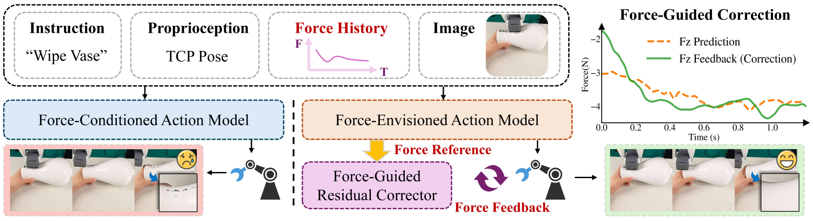
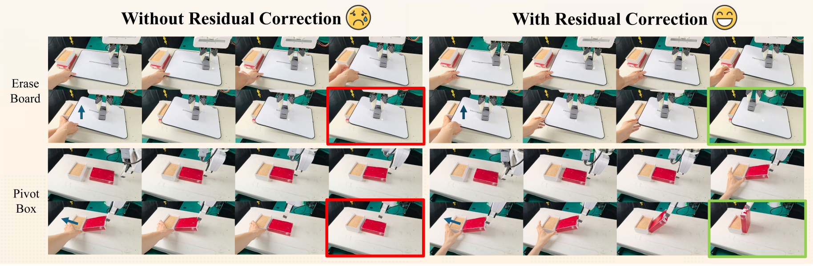
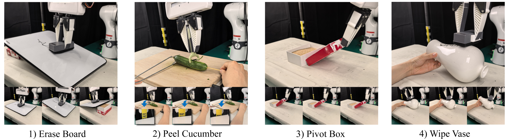
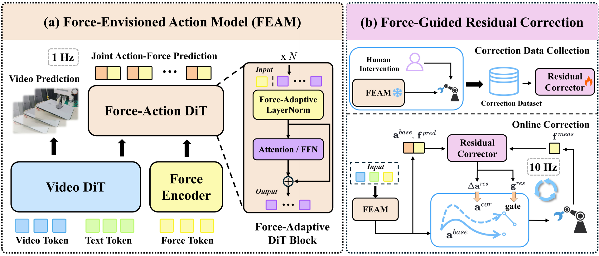

M
# FAWAM 慢读笔记

原文 PDF：[papers/pdfs/2606.08555-FAWAM.pdf](../pdfs/2606.08555-FAWAM.pdf) · 项目主页：<https://fawam.github.io>

## 一句话概括

FAWAM 把"力"用在**三个层次**上——感知(perception)、预测(prediction)、闭环执行(closed-loop execution)。它在一个 world action model(GE-Act)骨干上：(1) 把最近的 6 轴力/力矩历史编码成 contact feature,通过 **force-conditioned AdaLN-Zero** 调制动作生成;(2) 让 action decoder **同时预测未来动作和未来末端 wrench**(把动作和力拼在一起做联合 flow-matching),显式建模"我这么动会产生什么接触力";(3) 部署时用一个 10Hz 的 **Force-Guided Residual Corrector**,拿"预测 wrench 参考"和"实测 wrench 反馈"的**差值**在线修正后续动作,并用一个 gate 决定要不要修。4 个接触密集任务上平均成功率 85%,比最强纯视觉基线高 36.25%、比最强力感知基线高 21.25%。

## 阅读路线图

论文结构(19 页,主文 8 页 + 附录;v2 是 2026-06 版本)：

1. Introduction — 核心 argument:接触操作不是纯反应式的 observation→action,而应该像人一样**主动预测接触后果**并在偏差时修正
2. Related Work — 力感知策略 / world model 生成动作 / on-policy 模仿与残差纠错三条线
3. **Method(方法核心)**：
   - 3.1 Overview — 双频率结构:FEAM(1Hz) + Residual Corrector(10Hz)
   - 3.2 **Force-Envisioned Action Model(FEAM)** — 力编码 + AdaLN-Zero 调制 + 联合动作-力预测 + 两阶段训练
   - 3.3 **Force-Guided Residual Correction** — wrench 跟踪误差 + gate + 干预数据训练
4. **Experiments**：4 任务 + 主结果 + 消融(Obs/Pre/Res) + 扰动鲁棒性
5. Conclusion / Limitation
6. Appendix — 硬件、训练细节、逐任务分析、τ 消融

关键图表：**Fig.1 动机对比**(为什么"力当观测"不够)、**Fig.2 总览(方法核心)**、Fig.3 四个任务、Table 1 主结果、Table 2 消融、Table 3 扰动、Fig.4 执行时间、Fig.5 扰动 rollout 对比。

---

## 1. 动机：把力"当观测"不够，要"预测"+"闭环纠错"

作者一开篇就把已有力感知方法归为两类,并指出共同短板：

- 大多数方法把力**当作额外的观测模态**塞进策略([4,10]);
- 或者把力反馈接到**低层控制器**做 reactive control([11,12])。

这两类都只是"部分补偿了视觉的不完整和延迟",但**没有显式建模未来接触状态(比如接触力)如何演化**,因此**拿不到一个"预测的 wrench 参考"来指导执行期的修正**。

作者的类比很关键:**人做接触任务时会持续"预判"动作会带来什么接触后果,一旦实际感觉和预期不符就调整。** 所以接触操作应该是一个 **proactive prediction(主动预测)** 范式,而不只是 reactive 的 observation→action 映射。World model 天生擅长"预测未来状态演化",正好拿来做接触预测 + 接触感知的动作生成。但作者强调:**光预测还不够**——预测出来的接触信号还要在执行时当"在线参考",让机器人在失败前发现接触偏差并纠正。

图 1 是全文最精炼的动机图：

- **左(Force-Conditioned Action Model)**：只把力当观测,遇到接触偏差纠正不过来,擦花瓶失败(红框、哭脸)。
- **右(FAWAM)**：三层力整合——输入含 Force History,Force-Envisioned Action Model 输出一个 **Force Reference(预测 wrench)**,Force-Guided Residual Corrector 拿它和 **Force Feedback(实测 wrench)** 比对做闭环修正,擦花瓶成功(绿框、笑脸)。
- 右上那张小图很直观:橙色虚线是 **Fz 预测**,绿色实线是 **Fz 实测反馈(经修正)**,两条线在接触过程中被拉到贴合(都稳定在约 −4N),说明修正让实际接触力追上了预测参考。

三个贡献：(1) 提出在感知/预测/执行三层都用力的 world action model;(2) 提出 force-guided residual correction,用"预测力 vs 实测力"的差值纠动作;(3) 4 个任务上分别比最强纯视觉/力感知基线高 36.25% / 21.25%。

---

## 2. 方法总览：两个模块 + 两个频率

FAWAM 由两块组成,跑在两个频率上：

- **(a) Force-Envisioned Action Model(FEAM)@ 1Hz**：条件输入是 视觉 + 语言 + 力,输出**联合的动作块和未来力轨迹**。内部是一个 Force-Action DiT,力特征通过 **Force-Adaptive LayerNorm**(即 force-conditioned AdaLN-Zero)注入每个 DiT block。
- **(b) Force-Guided Residual Corrector @ 10Hz**：从人类干预数据里学一个残差纠正器,在线用一个 residual action + 一个 intervention gate 修正 base 动作。

**为什么两个频率**:world model 生成质量高但慢(1Hz 出一个动作块 + 力参考);残差纠正器轻(3 层 MLP)、快(10Hz),负责在这个动作块执行期内做细粒度闭环补偿。这是"慢基座 + 快纠错"的典型分工,和 RDP、CR-DAgger 是同一思路家族。

### 2.1 FEAM 之一：力编码 + AdaLN-Zero 调制

先把力历史压成一个紧凑的 contact feature：

$$
\mathbf{c}_t = \mathrm{Enc}_f\big(\mathbf{w}_{t-H_f+1:t}\big)
$$

- **wₜ ∈ ℝ⁶**:t 时刻腕部 6 轴力/力矩测量
- **Enc_f**:一个轻量 MLP(附录:3 层、hidden 256),和 action decoder 联合训练
- **cₜ**:contact feature,H_f 是力历史窗口

然后把 cₜ 通过 **force-conditioned AdaLN-Zero** 注入动作 DiT。设第 i 个 DiT block 原本的 AdaLN-Zero 参数是 uₜ⁽ⁱ⁾(含 attention 和 MLP 两个分支各自的 shift β、scale γ、gate g),FAWAM 预测一个力条件偏移量加上去：

$$
\bar{\mathbf{u}}_t^{(i)} = \mathbf{u}_t^{(i)} + \mathrm{MLP}_f^{(i)}(\mathbf{c}_t)
$$

- **MLP_f⁽ⁱ⁾ 的最后一层零初始化**——这是 AdaLN-Zero 的经典技巧:训练初期偏移为 0,模型**先恢复成原始的(纯视觉)动作 decoder**,再逐渐学出力自适应的细化。好处是不破坏预训练骨干,稳定收敛。

> 直觉:力不是当成一个 token 硬塞进序列,而是当成一个"调制信号",去微调每一层 DiT 的归一化参数——力在这里像一个"接触状态旋钮",轻推动作生成的分布。

### 2.2 FEAM 之二：联合预测动作 + 未来 wrench

这是 FAWAM 相对 FoAR 最关键的差异点:**不是预测"接触概率",而是直接回归"未来的力/力矩轨迹"。**

做法很简洁——**不额外挂一个孤立的力预测头**,而是把原来的 action projection 换成一个**联合 linear projection**,同时输出拼接的动作和 wrench 轨迹。作者说这逼着 decoder 学一个**动作生成与接触预测共享的表征**,捕捉"机器人运动 ↔ 物理接触后果"的耦合。

### 2.3 两阶段训练(flow-matching)

FEAM 基于 **GE-Act / GE-Base**(一个视频世界模型 + 动作 decoder),分两阶段：

**Stage 1 — 微调视频生成模型**(latent-space flow matching)：
给定历史多视角视觉 latent I_{t-K:t}、语言指令 Lₜ、未来视觉 latent 序列 Oₜ=[I_{t+1},…,I_{t+H}],构造插值输入 Ôₜ^α = α·Oₜ + (1−α)·ε^O(α∈[0,1],ε^O~N(0,I)),优化：

$$
\mathcal{L}_\text{stage1} = \mathbb{E}\Big\| v_\psi(\hat{O}_t^\alpha, \alpha, L_t, I_{t-K:t}) - (O_t - \epsilon^O) \Big\|_2^2
$$

即让 video model vψ 预测从噪声指向真值的速度场(flow matching 的标准形式)。

**Stage 2 — 冻结视频世界模型,训力感知 action decoder**：
设 õₜ 是适配后视频世界模型给的视觉特征,qₜ 是本体感知(proprioception)。把未来动作轨迹 Aₜ 和未来 wrench 轨迹 Wₜ 拼成 Zₜ=[Aₜ,Wₜ],同样构造插值 Ẑₜ^α = α·Zₜ+(1−α)·ε^Z(ε^Z=[ε^A,ε^W])。decoder 预测联合速度 [v̂ₜ^A, v̂ₜ^W] = vθ(Ẑₜ^α, α, õₜ, qₜ, cₜ),两项 loss：

$$
\mathcal{L}_\text{action} = \mathbb{E}\big\| \hat{v}_t^A - (A_t - \epsilon^A)\big\|_2^2,\quad
\mathcal{L}_\text{force} = \mathbb{E}\big\| \hat{v}_t^W - (W_t - \epsilon^W)\big\|_2^2
$$

$$
\mathcal{L}_\text{stage2} = \mathcal{L}_\text{action} + \lambda_F\,\mathcal{L}_\text{force}
$$

- **λ_F** 平衡动作生成与力预测,附录里 **λ_F = 1**
- 动作和力在**同一个 flow-matching 框架**下联合学出来

**训练规模(附录 A.1)**：8×A100,batch 64,bfloat16 + DeepSpeed ZeRO-2;视频世界模型微调 30k 步(lr 3e-5),再冻结、训力感知 decoder 30k 步(lr 1.5e-4)。

---

## 3. Force-Guided Residual Correction：用"预测力 vs 实测力"闭环

FEAM 一次出一个动作块,块内是**开环执行**的,遇到接触突变(压力不足、力过大、突然卡阻)反应不过来。所以加一个 10Hz 的轻量残差纠正器,只修当前块内剩余的动作。

### 3.1 纠正器设计

核心是把"接触偏差"显式暴露出来——计算 **wrench 跟踪误差**：

$$
\mathbf{e}^w_{t-H_e+1:t} = \mathbf{w}^\text{meas}_{t-H_e+1:t} - \mathbf{w}^\text{pred}_{t-H_e+1:t}
$$

- **w^meas**:实测 6D 力/力矩反馈
- **w^pred**:FEAM 预测的 wrench 轨迹(这就是 §2.2 联合预测的用途!)
- **H_e**:算误差用的历史窗口

纠正器还额外拿到:即将执行的 base 动作块 a^base_{t+1:t+Hp}、预测的未来 wrench 块 w^pred_{t+1:t+Hp}(作为"意图运动 + 接触演化的预览")、当前本体状态 qₜ。用**同一个力编码器**(此时冻结)得到 cₜ。整个纠正过程：

$$
\big(\Delta\mathbf{a}^\text{res}_{t+1:t+H_r},\; g^\text{res}_t\big) = \mathrm{Res}_\phi\big(\mathbf{e}^w_{t-H_e+1:t},\, \mathbf{c}_t,\, \mathbf{a}^\text{base}_{t+1:t+H_p},\, \mathbf{w}^\text{pred}_{t+1:t+H_p},\, \mathbf{q}_t\big)
$$

$$
\mathbf{a}^\text{cor}_{t+1:t+H_r} = \mathbf{a}^\text{base}_{t+1:t+H_r} + \kappa_t\cdot\Delta\mathbf{a}^\text{res}_{t+1:t+H_r}
$$

- **Δa^res**:残差动作修正量
- **Res_φ**:一个 3 层 MLP(为了实时)
- **g^res**:一个标量 **residual gate**,推理时转成二值 mask κₜ∈{0,1}:`g^res > τ` 时 κ=1(修),否则 κ=0(不动)。**保守阈值 τ=0.8**,避免纠正器扰动正常执行。

> 关键设计:**gate 决定"要不要修",残差决定"怎么修"。** 这和 FoAR 的 φ 门控有异曲同工之处,但 FAWAM 的 gate 是学出来专门守护"正常执行不被打扰",而修正的依据是**力的预测-实测差值**,不是简单的力阈值。

### 3.2 纠正数据怎么采、怎么训

**采集(用 FACTR 力反馈主从遥操)**：从臂在阻抗控制下保证安全顺应接触;主臂在自主执行时**跟踪策略生成的指令**(而不是镜像从臂反馈)——这样切换到人接管时**指令流连续**,减少动作漂移和力反馈抖动(这正是 CR-DAgger 也在解决的"接管不连续"问题)。看到异常接触时,操作者通过主臂修正剩余动作块,**修正指令与 base 策略指令的差**就记为残差目标。

**训练数据 = 干预段 + 非干预 rollout**：
- 非干预样本:残差目标设 0,gate 标签设 0
- 干预样本:gate 标签设 1
- 每个 batch **均衡混合**两类,既学会修异常、又保住正常行为

$$
\mathcal{L}_\text{res} = \mathbb{E}\Big[\big\|\Delta\mathbf{a}^\text{res} - \Delta\mathbf{a}^\text{gt}\big\|_2^2 + \lambda_\text{gate}\,\mathrm{BCE}(g^\text{res}_t, y_t)\Big]
$$

- **Δa^gt**:ground-truth 残差修正(来自人的干预)
- **yₜ∈{0,1}**:是否来自人类干预
- **λ_gate**:平衡残差回归与 gate 分类

---

## 4. 实验

**平台**:Franka Research 3(7-DoF)+ 腕部 **ATI Axia80-M8** 6 轴力/力矩传感器 + 3 个 RealSense D435i(1 腕部 + 2 第三人称:前视/顶视)。示教与人类干预用基于 **FACTR** 的力反馈主从遥操(从臂力反馈映射成主臂关节力矩,让操作者能"感觉到"接触力)。

**四个任务(Fig.3)**:Erase Whiteboard(擦白板)、Peel Cucumber(削黄瓜)、Pivot Box(翻装沙子的盒子)、Wipe Vase(擦花瓶)。都要求持续接触和力敏感执行,且**每个任务加了受控变化**增加多样性:白板/花瓶倾角、削黄瓜的桌高、翻盒子的沙盒位置。

**数据/采样频率**:每个任务 base 策略和所有 baseline 都用**同样的 90 条示教**训练;FAWAM 的残差纠正器额外用 **20 条人类干预 episode**。多视角图像 + 本体状态 @ 30Hz,6 轴力/力矩 @ 120Hz。每方法每任务 20 次试验,单次上限 60 秒。

**Baseline**:
- 纯视觉:**π0.5**(通用 VLA,无力输入)、**GE-Act**(FAWAM 的纯视觉骨干,同样的动作预测管线但去掉所有力相关组件)
- 力感知:**ForceVLA**(把力历史当额外观测,MoE 融合)、**TA-VLA**(额外用力预测当辅助目标)

### 4.1 主结果(Table 1)

| Policy | Erase Board | Peel Cucumber | Pivot Box | Wipe Vase | Avg. SR |
|---|---|---|---|---|---|
| π0.5 | 9/20 | 8/20 | 10/20 | 11/20 | 47.50% |
| GE-Act | 9/20 | 10/20 | 9/20 | 11/20 | 48.75% |
| ForceVLA | 11/20 | 14/20 | 13/20 | 13/20 | 63.75% |
| TA-VLA | 10/20 | 17/20 | 14/20 | 10/20 | 63.75% |
| **FAWAM w/o. Res** | 14/20 | 15/20 | 16/20 | 14/20 | 73.75% |
| **FAWAM (ours)** | **15/20** | **19/20** | **17/20** | **17/20** | **85.00%** |

读表要点：

- **纯视觉全部 < 50%**:光看图判断不出接触状态。
- **力感知基线到 63.75%**:加力有用,但把力当观测/辅助目标只是部分补偿。
- **FAWAM w/o Res(仅 FEAM,不含残差纠正)已到 73.75%**:说明"力条件调制 + 联合动作-力预测"这个 base policy 本身就很强,**比所有力感知基线还高约 10 个点**。
- **完整 FAWAM 85%**:残差纠正再补约 11 个点,主要提升执行期鲁棒性。

### 4.2 消融(Table 2)：三个力设计各自贡献多少

Obs=力当观测；Pre=联合动作-力预测；Res=残差纠正。

| Obs | Pre | Res | Erase | Peel | Pivot | Wipe | Avg. SR |
|:-:|:-:|:-:|---|---|---|---|---|
| | | | 9/20 | 10/20 | 9/20 | 11/20 | 48.75% |
| ✓ | | | 12/20 | 12/20 | 9/20 | 12/20 | 56.25% |
| ✓ | ✓ | | 14/20 | 15/20 | 16/20 | 14/20 | 73.75% |
| | | ✓ | 12/20 | 15/20 | 12/20 | 15/20 | 67.50% |
| ✓ | ✓ | ✓ | **15/20** | **19/20** | **17/20** | **17/20** | **85.00%** |

结论链条很清楚：

- **只加 Obs(力当观测):+7.5%**(48.75→56.25)——被动力条件化远远不够。
- **再加 Pre(联合动作-力预测):+17.5%**(56.25→73.75)——**预测未来 wrench 逼出"物理落地"的动作表征,这是最大单项增益**。
- **只有 Res(无预测参考,纠正器只能用实测力):+18.75%**(48.75→67.50)——残差纠正单独也很强,但**没有预测 wrench 当参考,上限低于完整模型**。
- **三者齐全 85%**——说明预测和纠正是**互补**的,不是重复的。

Fig.4(执行时间)另外显示:完整模型完成任务**最快**,说明力引导的残差纠正能及时调整,减少"无效接触调整"的磨蹭。

### 4.3 扰动鲁棒性(Table 3)

执行中**人为加扰动**:擦板时倾斜板、削黄瓜时改桌高、翻盒时移动沙盒、擦花瓶时改花瓶尾部高度。每设置 5 次试验。

| Policy | Erase board | Peel cucumber | Slice cucumber | Wipe vase |
|---|---|---|---|---|
| w/o. Correction | 0/5 | 2/5 | 0/5 | 1/5 |
| **w/. Correction** | **3/5** | **5/5** | **4/5** | **4/5** |

图 5 定性展示:没有纠正器时策略基本开环执行动作块,适应不了接触变化——擦板卡死、翻盒倾倒(红框失败);有纠正器时,用预测-实测 wrench 差值调整后续动作、恢复稳定接触、完成任务(绿框成功)。作者的落脚点:**光预测力在执行期扰动下不够,纠正器把"力差值"变成"纠正行为",才真正闭上了环。**

---

## 5. 与 FoAR / CR-DAgger 的对比（你的核心关注点）

你最初问的就是"末端接触**预测期望力**",FAWAM 是这条线里最贴题的:它**真的回归未来的 wrench 轨迹**,而不是像 FoAR 只输出一个接触概率。三篇放一起看：

| 维度 | [[2411.15753-FoAR\|FoAR]] | [[2606.08555-FAWAM\|FAWAM]](本篇) | [[2506.16685-CR-DAgger\|CR-DAgger]] |
|---|---|---|---|
| 骨干 | RISE(点云 + diffusion) | GE-Act 世界模型(视频 + flow-matching DiT) | Diffusion Policy + 残差 |
| 力怎么用 | **预测接触概率 φ**,门控力特征融合 | **预测未来 wrench**,三层(感知/预测/执行)都用 | 力当残差策略的输入/输出之一 |
| 是否预测"期望力" | 否(只预测接触与否) | **是(直接回归 wrench 轨迹)** | 否(靠人的力握把叠加修正) |
| 执行期闭环 | reactive control:力不足朝预测方向补固定步 ε | **residual corrector:预测-实测 wrench 差值 + gate** | 残差策略叠加 + 顺应控制 |
| 纠错数据 | 无(纯离线示教) | 20 条人类干预(FACTR 遥操) | on-policy 人类 delta 修正(顺应握把) |
| 控制方式 | 简单位置控制 | 位置 + 残差修正 | 顺应/导纳控制 |

**一句话定位**：
- **FoAR** 回答"**什么时候该听力**"(接触相位),用最简单的位置控制。
- **FAWAM** 回答"**接触会产生多大力、实际差了多少、怎么补**"(显式 wrench 预测 + 闭环残差),是三篇里对"期望力"建模最直接的。
- **CR-DAgger** 回答"**策略错了怎么用人高效地修**"(顺应干预 + 残差),力更多是采集/执行接口层面的。

值得注意:FAWAM 的残差纠正数据采集(FACTR 主从、保持指令连续、记录 delta)和 **CR-DAgger 高度同源**,本文 Related Work 也直接引了 CR-DAgger([46]);可以认为 FAWAM = "世界模型预测 wrench" + "CR-DAgger 式残差纠错"的结合体。

## 6. 复现价值与边界

**亮点/可复现点**：
- 三层用力的框架清晰,**联合预测 wrench** 这个点改动不大(把 action projection 换成 action+wrench 联合 projection)却带来最大单项增益(+17.5%),很值得借鉴。
- AdaLN-Zero 零初始化保证不破坏预训练骨干,工程上稳。
- 残差纠正器只是 3 层 MLP,10Hz 实时,轻量。

**边界/需注意**(作者在 Limitation 里坦白)：
- **力没进视频生成模型**:因为缺"视频 + 同步力/力矩"的大规模数据集,力只在 action 分支里和动作耦合,视频世界模型本身是"无力"的。
- **残差纠正器只用 20 条人类干预**训练,覆盖的失败模式有限,大偏差下恢复能力受限。
- **末端 wrench 只是间接接触信息**:作者计划未来引入显式接触状态表示(局部接触帧、稠密触觉)。
- 依赖较重:GE-Base/GE-Act 视频世界模型 + 8×A100 训练,不是轻量方案;力 120Hz、图像 30Hz、FEAM 1Hz、纠正器 10Hz 这套频率栈也偏复杂。
- τ=0.8 等阈值、λ_F=1、各 horizon(H_f/H_e/H_p/H_r)的具体数值:τ 和 λ_F、训练超参附录给了,但各 horizon 的确切长度 note 里未逐一确认,复现前需查附录/代码。

## 7. 一句话记忆点

**FAWAM = 世界模型(GE-Act)+ 力在三层都用:AdaLN-Zero 力调制(感知)+ 联合回归未来 wrench(预测)+ "预测力 vs 实测力"差值驱动的残差纠正器(执行闭环)。** 关键洞察:接触操作要像人一样**先预判接触后果、再按力偏差闭环纠正**;把力从"观测"升级为"可预测的参考信号"是最大增益来源。

